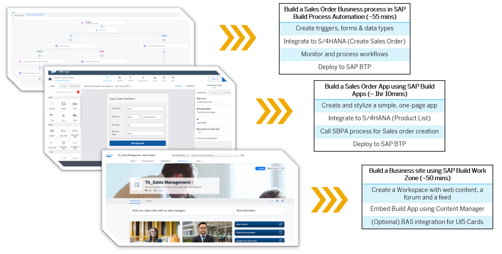

# Experience SAP Build in Action – End-to-End

The “Experience SAP Build in Action – End-to-End” workshop is a multi-part virtual learning series where participants will learn how to use the SAP Build suite to create, integrate and deploy a Sales Order business process across SBPA, Build Apps, Work Zone and S/4HANA Cloud.

The purpose of this Workshop is for you to familiarise yourself with the SAP Build tools by implementing an End-to-End Sales scenario based on the SAP Business Technology Platform (BTP) to address a real business challenge. 

Our desire is to provide a better showcase for the power of Build Apps by demonstrating how an end-to-end process can be built easily, while highlighting the tools’ integration capabilities in a way standalone experiences may not.

## Goal

This workshop packages exercises in SAP Build Process Automation, SAP Build Apps and SAP Build Work Zone in to a single connected experience.

The goal is to demonstrate not only the scope and flexibility of each individual SAP Build tool, but also to highlight the ease and power of integration between the Build tools and S/4HANA Cloud.

