### Create a Business Process Project

In this section you will also create the following

- Add a Data Type 
- Create and configure API trigger

> The lobby is a central page for creating, accessing, and managing your projects in SAP Build. You can access business application processes, company configured templates, and other resources for your end-to-end business process.

Choose **[Lobby]({link|https://xp262-tg0x69xc.eu10.build.cloud.sap/lobby})** to open the entry page of **SAP Build** Process Automation.

1. In the **Lobby**, choose **Create** and then **Create**.

   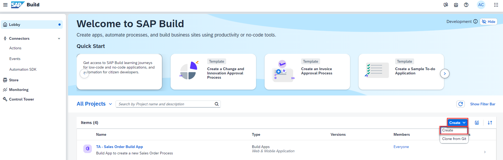

2. Select **Automated Process** and then **Next**.

   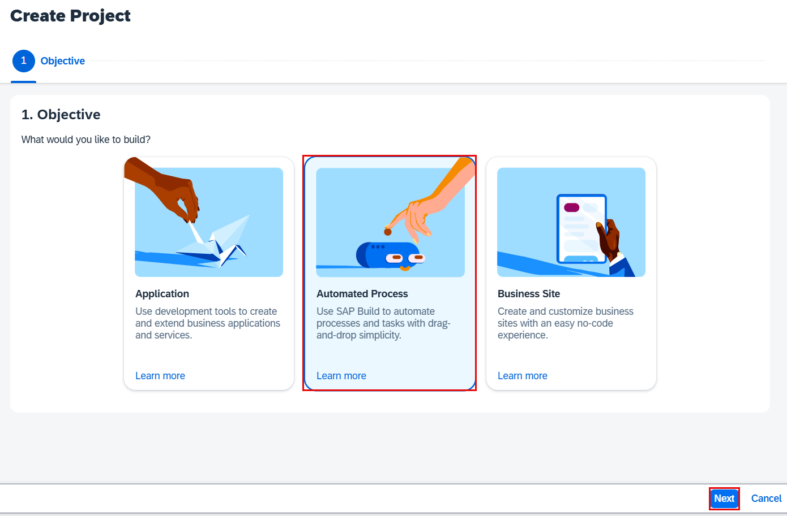

3. Select **Process** and then **Next**.

   

4. On the next screen, enter the following:

    | Input Field | Input Value    |
    | ----------- | -------------- |
    | Project Name   | **Sales Orders Management {placeholder\|userid}**|
    | Description    | **Sales Orders Management Project {placeholder\|userid}**|

5. Choose **Review**.

   

   > **Note:** Make sure to use the provided naming conventions. Otherwise, you will encounter issues later on in the exercise.

6. Choose **Create**

   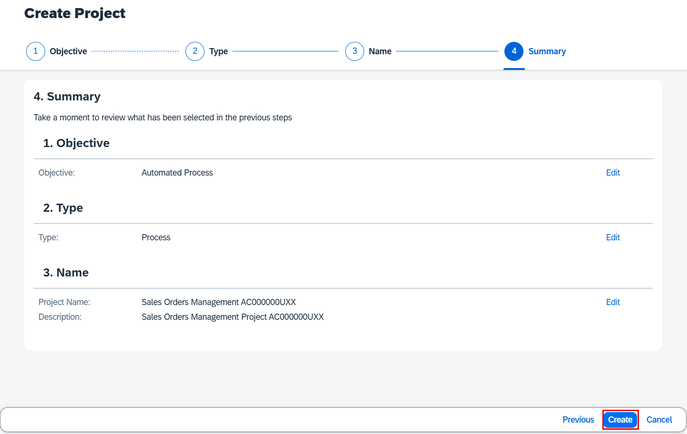

7. Choose **Accept** if prompted.

   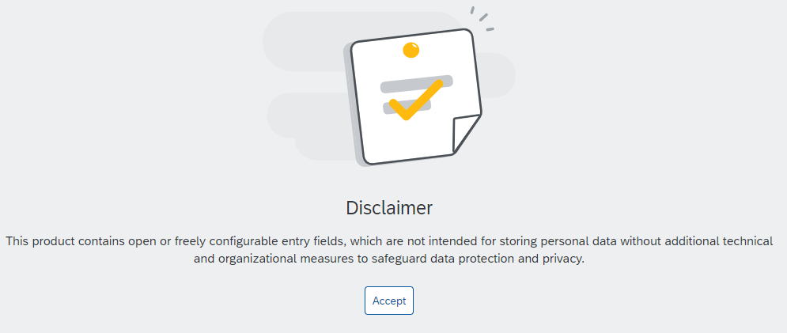

### Create a Business Process

A new tabs opens with the newly created project. Inside a project, you can create a process. This process is equivalent to a workflow in any business scenario. You can create this process from different skills such as forms, decisions, automations.

1. In the **Create Process** dialog box, enter the following values and choose **Create**.

    | Input Field | Input Value    |
    | ----------- | -------------- |
    | Name   | **Order Processing**|
    | Description    | **A process to handle sales orders**|

   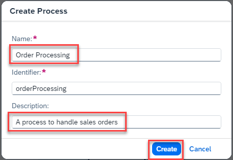

2. If you see the below prompt, please choose **Close**.

   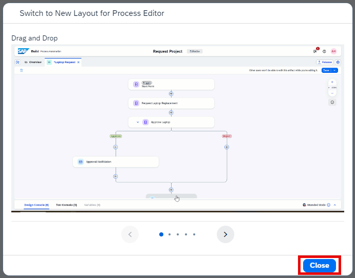

3. The following will appear

   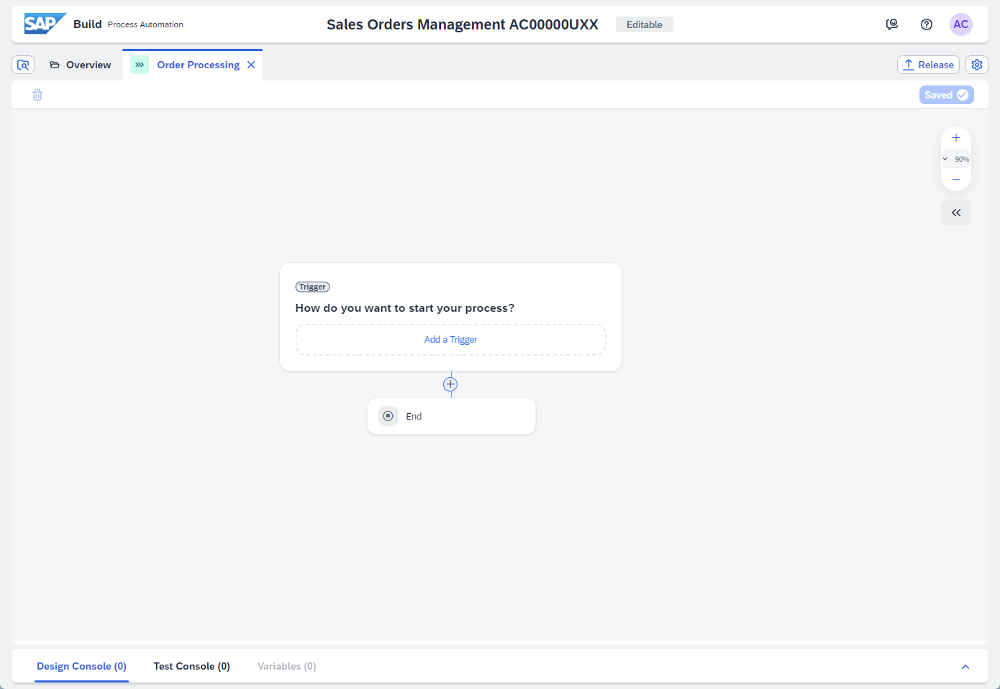
  
### Create a Data Type

1. Choose on **(+)** **Create** > **Data Type**.    

2. Name the data type **Sales Order** and Choose **Create**.

   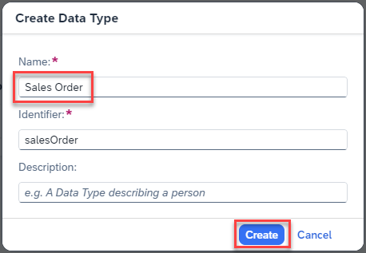
   >Close **Project Content** if needed to see the **New Field**

3. Choose **New Field** to add new fields to the data type **Sales Order** and enter the following. 

     | Field Name             | Type   |
     | ---------------------- | ------ |
     | **material**             | String |
     | **quantity**             | Number |
     | **shipToParty**          | String |
     | **salesOrderType**       | String |
     | **salesOrganisation**    | String |
     | **distributionChannel**  | String |
     | **expectedDeliveryDate** | Date   |
     | **soldToParty**          | String |

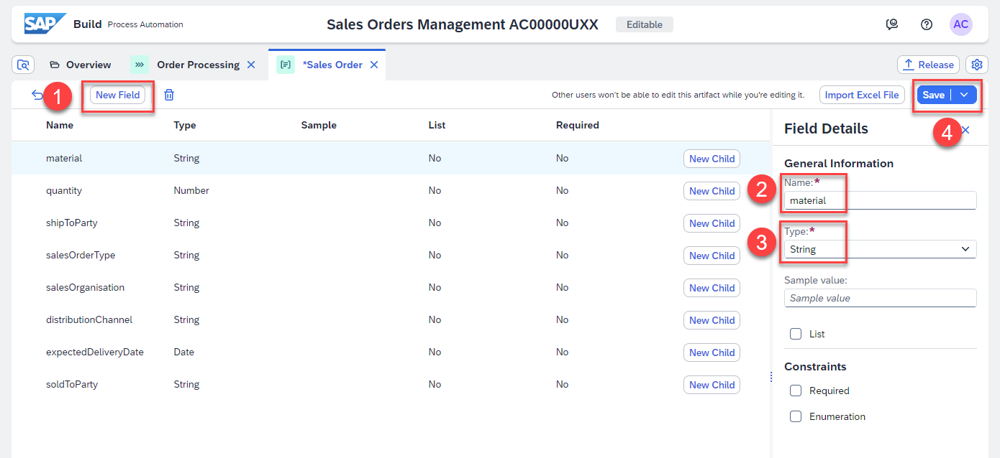

4. Choose **Save** after following all the steps for the entries above.

   > **IMPORTANT:** The spelling and casing of the fields as well as any extra spaces is crucial, because for the API to trigger the process it will require the fields exactly as written.

5. Your final data type looks as below after adding all the Field names.

   

### Create and Configure the API trigger

1. Navigate back to your **Order Processing** page, choose **Add a Trigger**. 

   

2. Choose on **API Trigger**.

   

3. Enter the name as **Sales Order Trigger** and choose **Create**.

   

4. A trigger has been added to your process. Choose the **<<** icon to open the **Process Details** screen.

   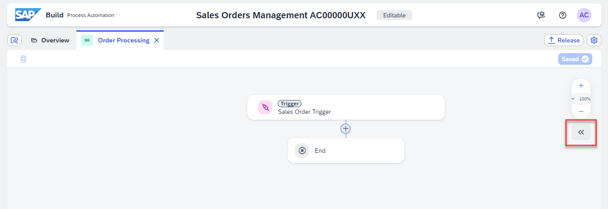

5. Choose **Variables** and then choose **Configure** (under **Process Inputs**) to configure inputs.

   

6. In the **Configure Process Inputs** window, choose **Add Input** to add parameters.

     Add the following parameter:

     | **Name**                | **Type**      | **Required** |
     | ----------------------- | ------------- | ------------ |
     | **salesorderdetails** | **Sales Order** | **true**      |

7. Choose **Apply**.

   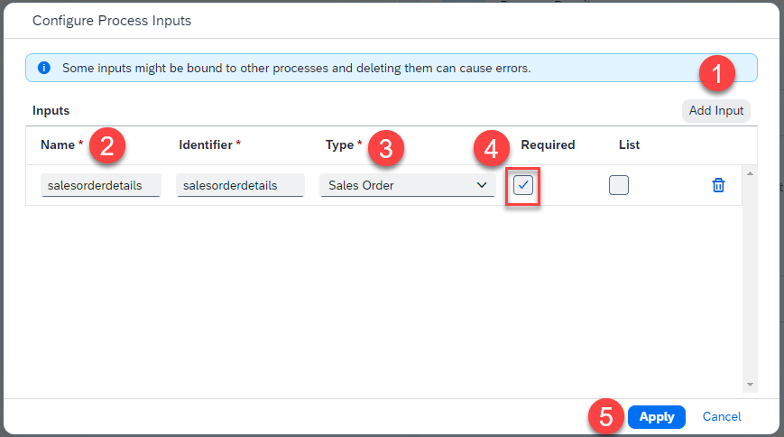

8. To save the Process, choose **Save** .

   

