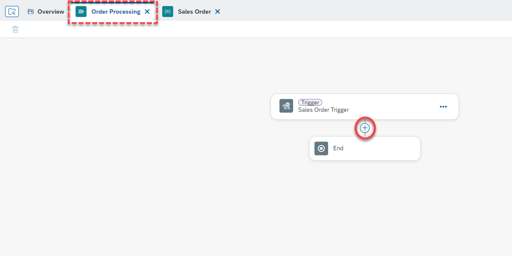
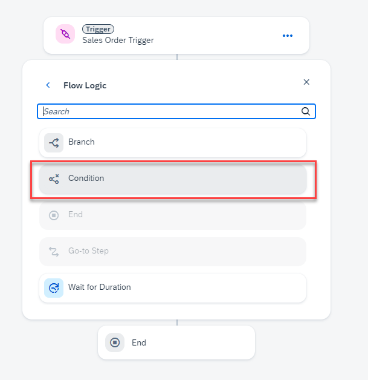
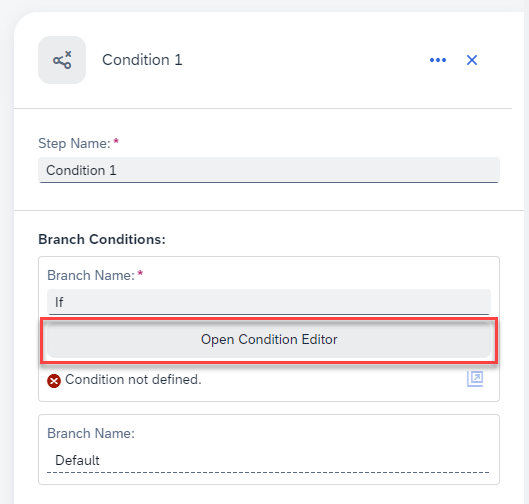
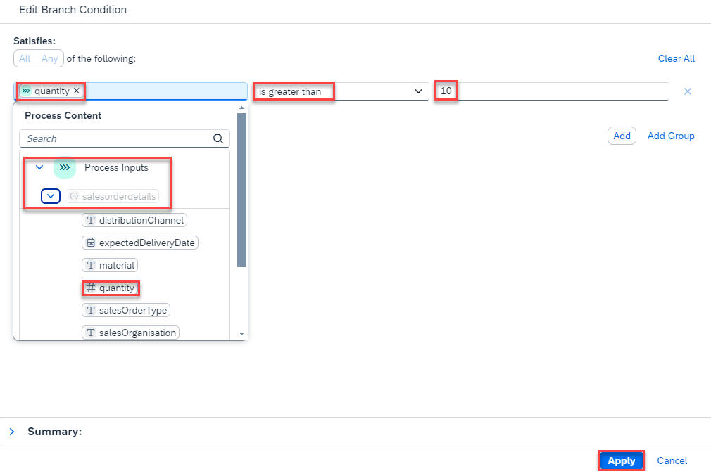

### Create and configure a Process Condition

Once the trigger is created, define which process flow should run based on if/else condition criteria.

1. To add a condition to a process, go to the **Order Processing** tab to open the Process Builder.

   

2. Choose **(+)** below the Trigger. Select **Controls and Events**. 

   

3. Select **Condition**.

   

4. To configure the condition, choose **Open Condition Editor**.

   

   > Process content will contain a list of attributes that have been defined in previous skills. For example: in the screenshot, you can see attributes from the API trigger. You will use this process content to configure different skills during business process modelling.

5. Edit your branch condition:

   - Select **quantity** from the Process Content.
   - Select **is greater than**.
   - Enter **10** as the value.
   - Choose **Apply**.

   

   You have configured your **if** branch to: **if quantity is greater than 10**.

6. To save the Process, choose **Save**.

