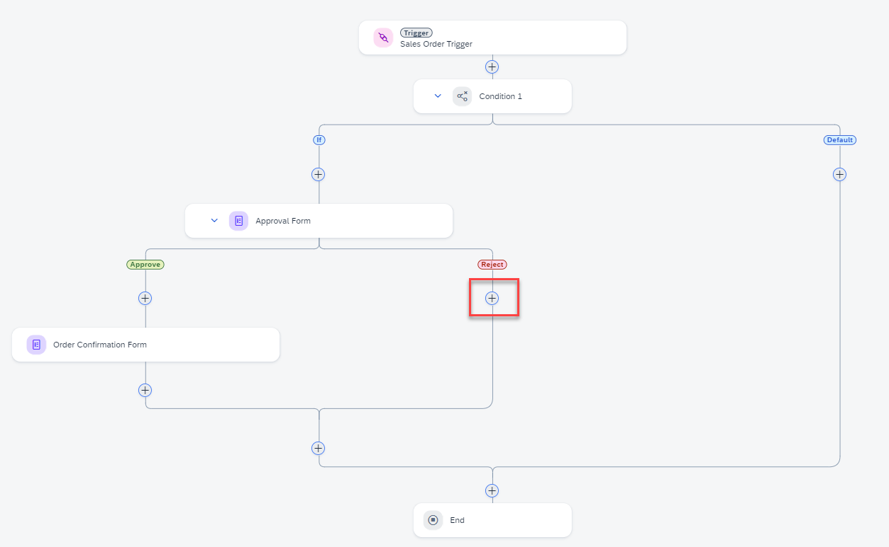
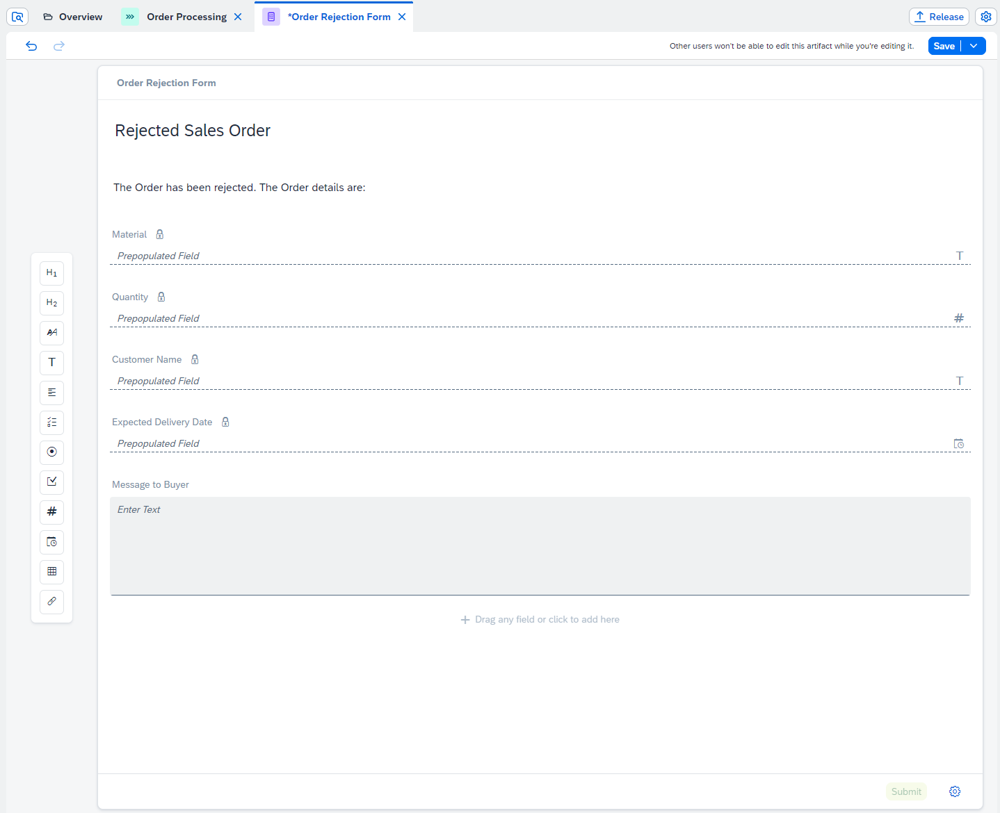
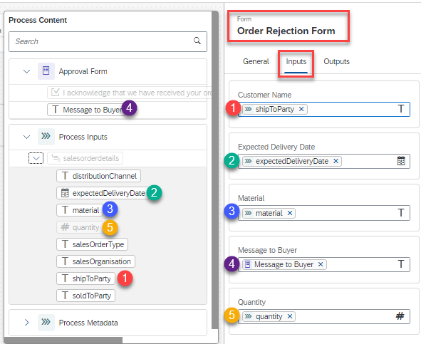

### Create and Configure the Order Rejection Notification Form

>In this step, you will send out a notification form if the order is rejected.

1. Choose on the **(+)** after the **Reject** node.
   

2. Choose on **Form** >**Blank Form**.
   

3. Create Form Pop-Up will appear.

   * Enter **Order Rejection Form** in the **Name** field.
   * Choose on **Create** button.

   

4. Select **Order Rejection Form**. 

   Choose on **Open Editor** in the **General** tab.

      

5. Design the form by dragging and dropping the corresponding Form elements as shown below.

   | **Field type** | **Field Value**                                               | **Configuration (Read Only)** |
   | --------------- | ------------------------------------------------------------ | ----------------------------- |
   | Headline 1      | Rejected Sales Order                                         |                               |
   | Paragraph       | The Order has been rejected. The Order details are:          |                               |
   | Text            | Material                                                     | X                             |
   | Number          | Quantity                                                     | X                             |
   | Text            | Customer Name                                                | X                             |
   | Date            | Expected Delivery Date                                       | X                             |
   | Text Area       | Message to Buyer                                             |

   

6. Choose **Save**.

7. After the Form design completed go back to the process **Order Processing**. 

   Select the **Order Rejection Form** 

8. Choose the **General** tab.

9. In the **Subject** field:

   - Type **Your order has been rejected for**
   - Map **material** from **Process Content** => **salesorderdetails**

10. In **Recipients** under **Users**, enter the email address as **{placeholder|userid_lc}@sapexperienceacademy.com**
   

11. To save your work, choose **Save**. 

12. Configure the inputs of **Order Rejection Form**. Navigate to **Inputs** and map the fields accordingly.

    

13. To save your work, choose **Save**.

