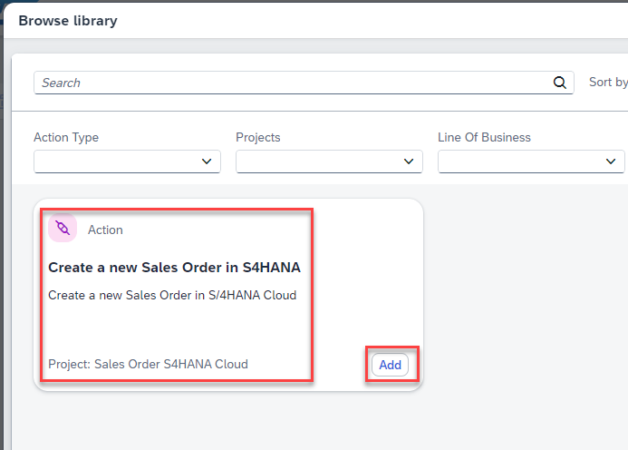
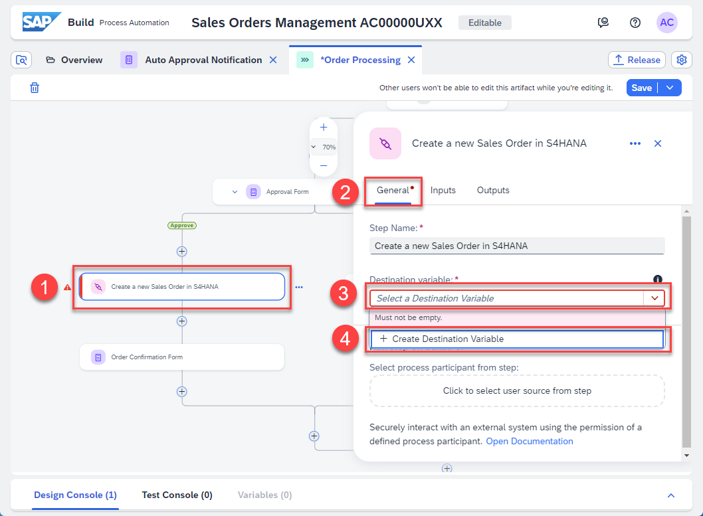
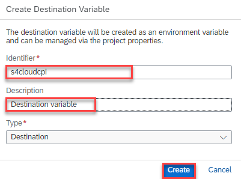
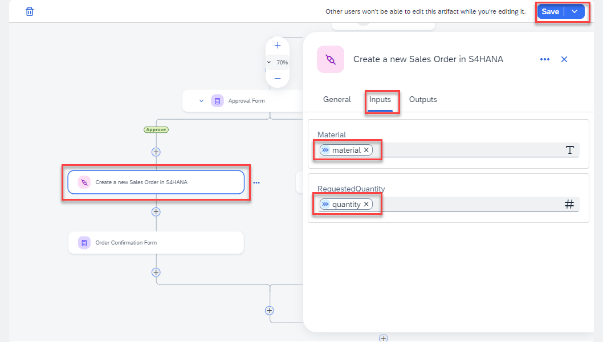

### Use the Action Project to Call the S4 System for Sales Order Creation.

In this step, you will use the Action Project - **Create a new sales order in S/4HANA**. This action project is already created and available in the lobby. It will be used to create a sales order in S/4HANA Cloud.

1. To add the Action Project, choose on the **(+)** icon after the **Approval Form**. 

2. Select **Action**. 

3. In the Browse library page, find the Action project with the name  **Create a new Sales Order in S4HANA** and choose **Add**.

> **Note:** If this step fails, the issue is likely related to browser behaviour. The action library depends on the browser’s iframe technology, which can sometimes be blocked or affected by cached data.
> 
>
> If you encounter this issue, try the following:
> - Refresh both browser-tabs where the Process Project and the SAP Build Lobby is opened. Then repeat step 3.

<!-- 
> - If that doesn’t work, clear your browser cache. Then repeat step 3.
> - If the issue persists, try using a different browser. Then repeat step 3.
-->

4. Choose the **Action project** and select the **General tab**.

    Select **+ Create Destination Variable** using the Destination variable **dropdown**.

5.  A dialog opens up to create a destination variable. Enter the following values and choose **Create**.

    | Input Field | Input Value            |
    | ----------- | ---------------------- |
    | Identifier  | s4cloudcpi           |
    | Description | Destination variable |
    | Type        | Destination |

6. Select the Action Project **Create a new Sales Order in S4HANA** and select the **Inputs** tab. 

Configure the **Inputs** section with following details:

   | Form Input Fields    | Process Content Entry  |
   | -------------------- | ---------------------- |
   | Material             |  material            |
   | Quantity             |  quantity            |
  

7. To save your work, choose **Save**.

>**Note:** There is no Action Project to place the order in S/4HANA when the order is auto approved.  In a **productive system**, you would need to add an equivalent Action Project  to the Default path **after the conditional branch**.

