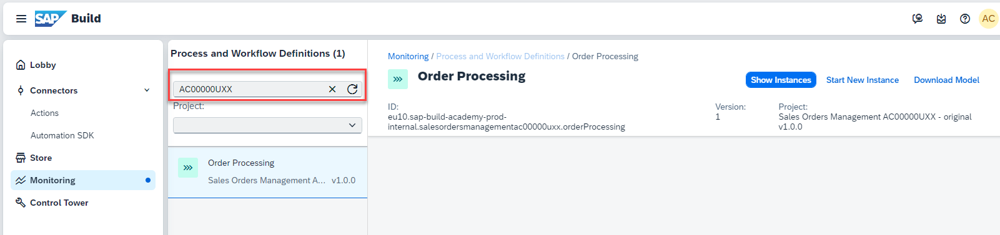

### Run the Business Process

1. Let us test the API Trigger in the **Control Tower** tab of the SAP Build [Lobby]({link|https://xp262-tg0x69xc.eu10.build.cloud.sap/lobby}).

2. Choose **Environments** > **Public**, and then the **Process and Workflows** tile.

   

3. Search for **{placeholder|userid}** to display your project.
   

4. Choose  **Start New Instance**.

   

4. Remove the example payload in the dialog.
   Use the following JSON in the dialog.

   ```json
   {
      "salesorderdetails": 
         {
            "distributionChannel": "10",
            "expectedDeliveryDate":"2025-02-25",
            "material": "MZ-FG-C900",
            "quantity":11,
            "salesOrderType":"OR",
            "salesOrganisation":"1710",
            "shipToParty":"SAP",
            "soldToParty":"1000292"
         }
   }
   ```

   > The quantity must be entered as a number (no quotes) and dates, must be entered in the format above for the expected delivery date.

5. Choose **Start New Instance and Close**.

   


You have successfully run your project. It is time to monitor the process flow and access the tasks.