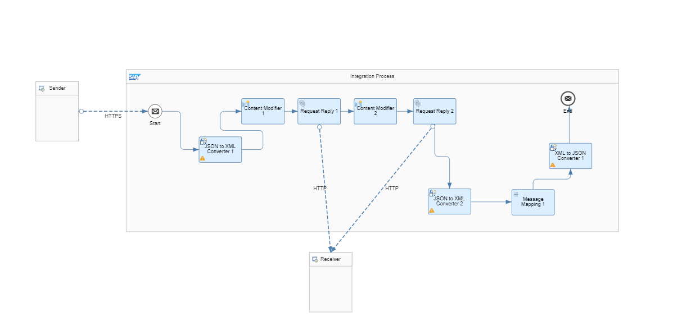
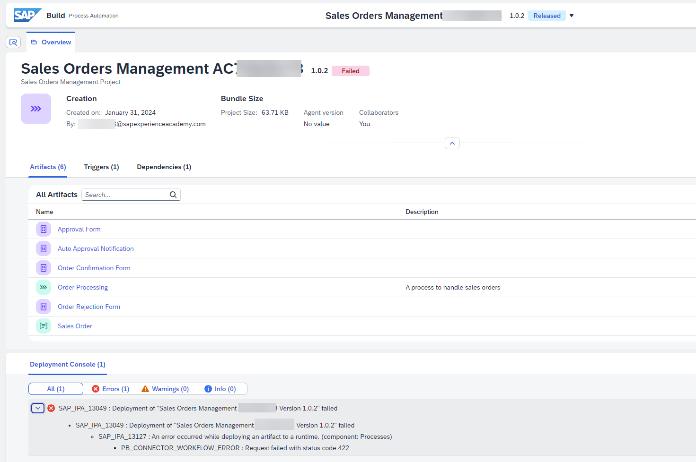

## 1. Integration of S/4HANA system via SAP Integration Suite

The Action project **Create a new Sales Order in S4HANA** is using the Destination Variable `s4cloudcpi` to access the S/4HANA backend using an OData connection that is defined in an SAP Integration Suite - iFlow.

### 1.1. Integration Flow (iFlow)

## 2. Error while deploying your process

### 2.1. Symptom

Deployment fails with a **PB_CONNECTOR_WORFLOW_ERROR: Request failed with status code 422** message.

### 2.2. Resolution

Code 422 indicates that there is problem with your business process model. Please check that you followed all of the provided instructions. In particular, please check that you entered the correct email address for the recipient of each form.