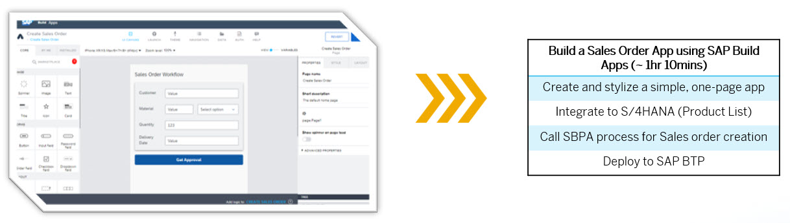

# Create a Sales Order App Using SAP Build Apps

You will create an app for entering the sales order data and trigger a business process with SAP Build Apps. This app will trigger an existing sales order approval process in SAP Build Process Automation.

## Script Overview

This tutorial shows how to use SAP Build Apps to create, stylize, and deploy a simple, one-page app to SAP Business Technology Platform.

Specifically, the app lets the user enter sales order details and then send these to an SAP Build Process Automation process for approval.

> **Note:** Make sure to exactly follow the exercise documentation and use the provided naming conventions. Otherwise, you will encounter issues.

## Prerequisites

- Your **{placeholder|userid}** user and Password
- You have access to the SAP Build Apps [Lobby]({link|buildlobby})
- You have created a process in SAP Build Process Automation or use our workshop template process

## Goal

In this workshop, you will learn how to:

- Create a simple UI form
- Trigger from your app a workflow in SAP Build Process Automation
- Populate a dropdown list from an S/4HANA Cloud backend
- Deploy an SAP Build app to SAP BTP

At the end of this workshop, your app will look something like this:

## Further information

- [Product Page](https://www.sap.com/products/technology-platform/no-code-app-builder.html)
- [SAP Discovery Center - Services for SAP Build Apps](https://discovery-center.cloud.sap/serviceCatalog/sap-build-apps?region=all)
- [Tutorials for SAP Build Apps](https://developers.sap.com/tutorial-navigator.html?search=SAP+Build)

- [Developer Community for SAP Build Apps](https://community.sap.com/topics/build-apps)

