### Create an App Project

>Note that there are 2 different approaches for this tutorial step. 
>
> You can do the first approach, **Basic steps**, which will teach you about UI components, stylizing them, and organizing them on the page.
>
> Alternatively, to save time, you can do the second approach, **(Optional) Start with Template Project**, which will bypass the details of adding and stylizing components, and instead teach you how to copy an existing SAP Build Apps template project which has some of the UI components for this tutorial already built. 
>

### Basic Steps - Create New Project

First, we need to create a brand new project from the build lobby.

1. Select **[Lobby](https://xp262-tg0x69xc.eu10.build.cloud.sap/lobby)** to access the entry page of **SAP Build**.

2. In the **Lobby**, choose **Create** and **Create**.

    

3. Select **Application** and **Next**.

    

4. Select **Frontend** and **Next**

    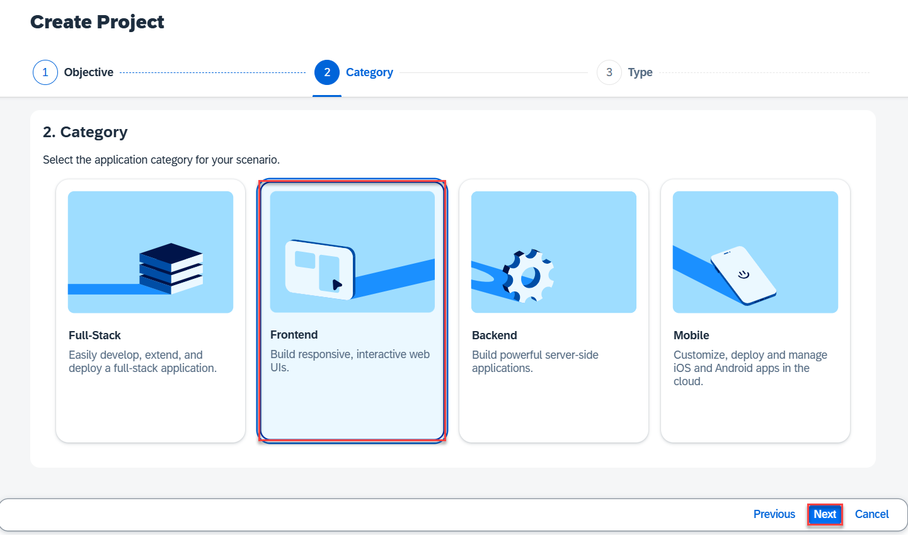

5. Select **Web & Mobile Application**.

6. Select **Next**

    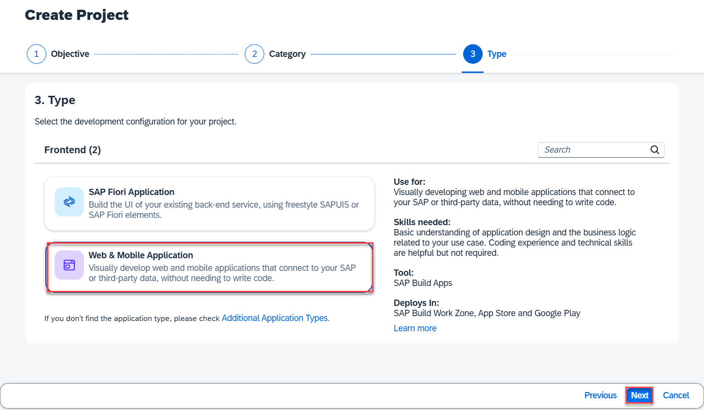

7. On the next screen, enter the following:

    | Input Field | Input Value    |
    | ----------- | -------------- |
    | Project Name   | **Create Sales Order {placeholder\|userid}**|
    | Description    | **SAP Build Apps Sales Order Project {placeholder\|userid}**|

8. Select **Review**.

    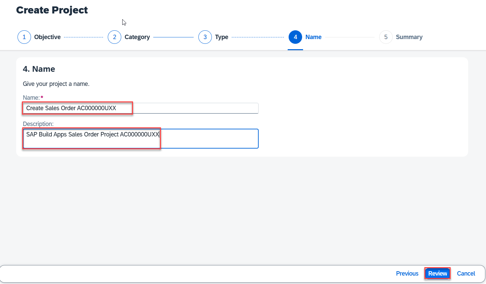

- You can see the Summary.

9. Select **Create**

    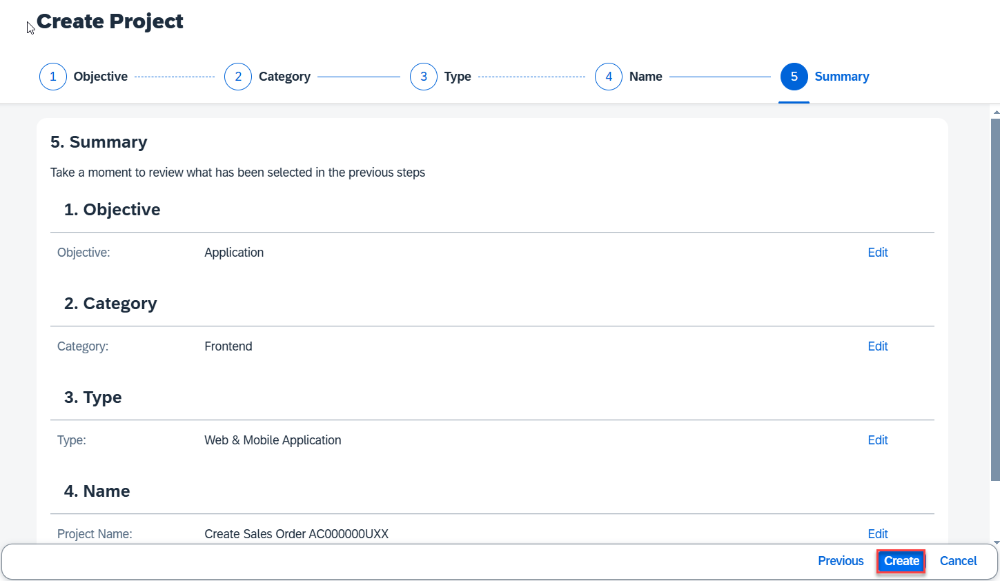

>By default your new application contains a page with title and text fields. In this step, you will focus on turning this page into your app – by adding components like input boxes and buttons, and then styling them. 
This is known as creating the user interface, also known as the UI.

### Basic steps - Create UI

1. Change from **FullScreen** to **Mobile**.

    

2. Select the **text field**, and Choose the **Bin** to delete it.

    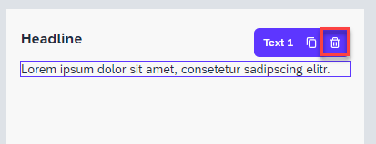

3. In the **Properties** tab, change the **Page name** to **Create Sales Order**.

    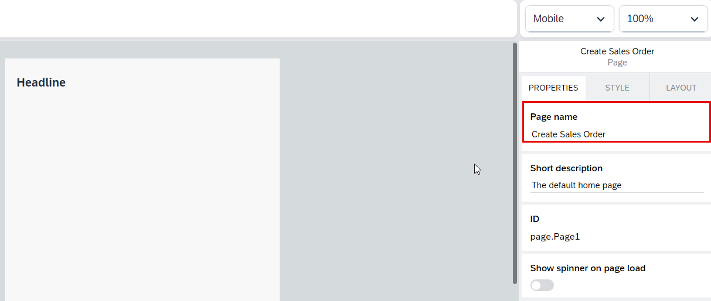

4. Select the title field, and in the **Properties** tab, change the **Content** text to **Sales Order Workflow**.

    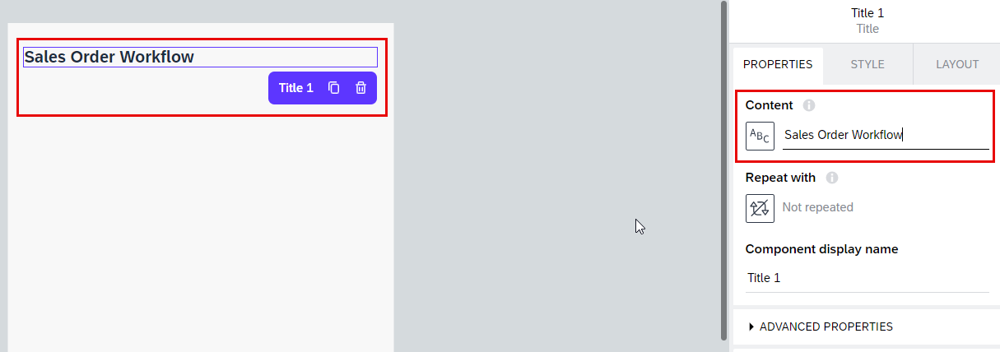

5. Drag a **Container** component from the left hand panel to your canvas. Container components let you group components and configure the collection of the components as a single unit.

    

6. With the container selected, in the **Properties** tab, change the **Component display name** to **Form**.

    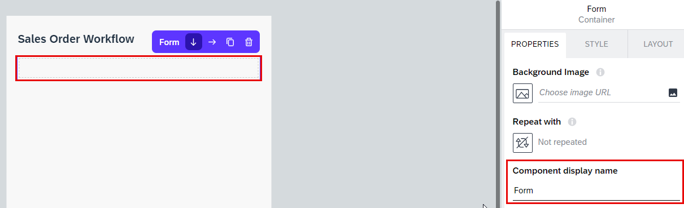

7. Still with the container selected, open the **Style** tab, Choose the dropdown icon for the **Layout Container**, and Choose **Edit**. 

    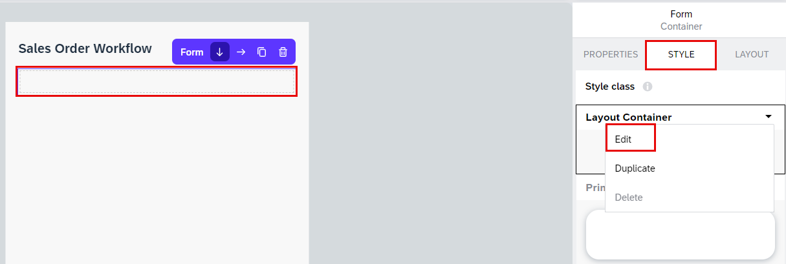

8. For background color.
    
   Select **TRANSPARENT**  and open **UNIVERSAL BACKGROUND COLORS**.
   
   Select **Level 4 background**.

    

9. Expand the **padding** section

    

10. Choose each rectangle **Opx**. Go to **Theme**, and select the **L** size.

    

11. This is what you should see.

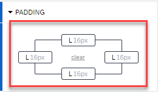

12. Let's save the style by scrolling up in the **Style** tab, and choose **New Style**.

    

13. Enter **Layout Form Container** Choose **OK** and **Save**

    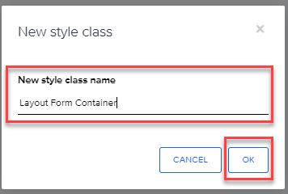

14. Drag in another container into the outer container  (Form). It may be easier to drag it into the **Tree** view on the lower right, so you can put it precisely where you want. The **Tree** makes it easier to select specific components and to create a hierarchy of components on the page.

     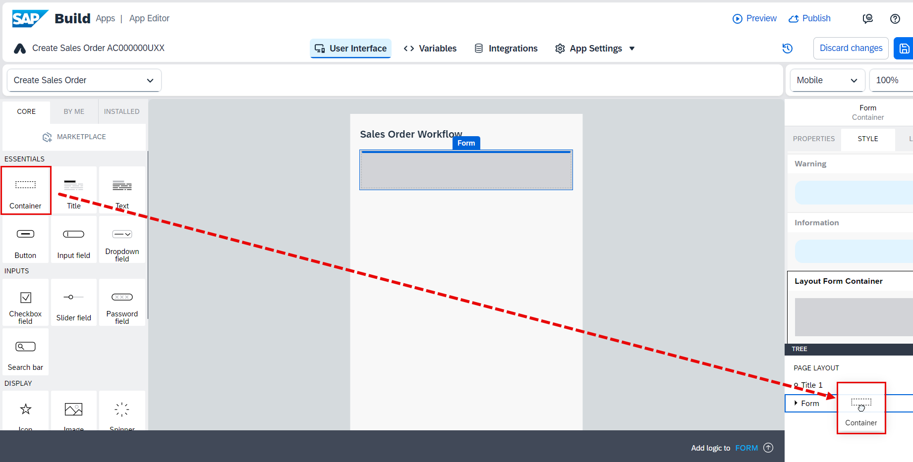

    <!--Drag two container components more from the left hand panel:-->

15. Inside the new container (Container 1), add a **text**  and an **input field**. 
    
    

16. Select the new, inner container (Container1 from the Tree view)

17. Go to the **Layout** tab, and under **Layout**, set the container to **Horizontal**. 

18. Set **Align components** to the middle (*Align children vertically to the middle*).

    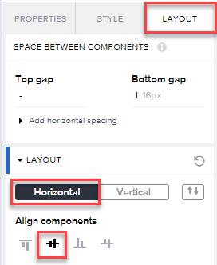

19. Select the **text** field, go to the **Layout** tab, then **Width and Height**, and set the width to exactly 75px.

    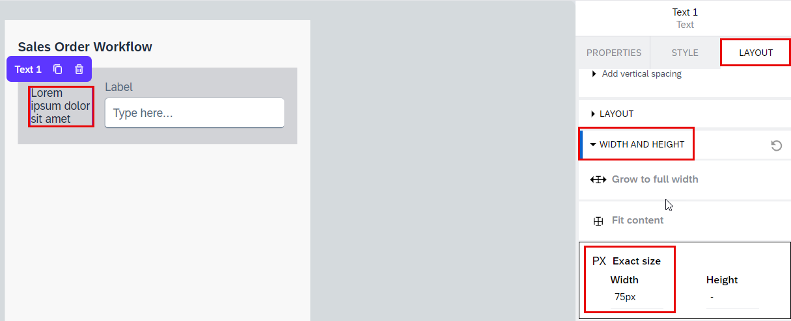

20. Select the **input field**, and in the **Properties** tab, set the **Label** property to an empty string, that is, delete the `Label` property value). 

    

21. From the **Tree** view, select the inside container ( **Container1** ).

    

22. Duplicate the container by Choosing on the **Duplicate** icon.

    

- Repeat this 2 more times, until you have 4 fields.

23. Select **Save**.

    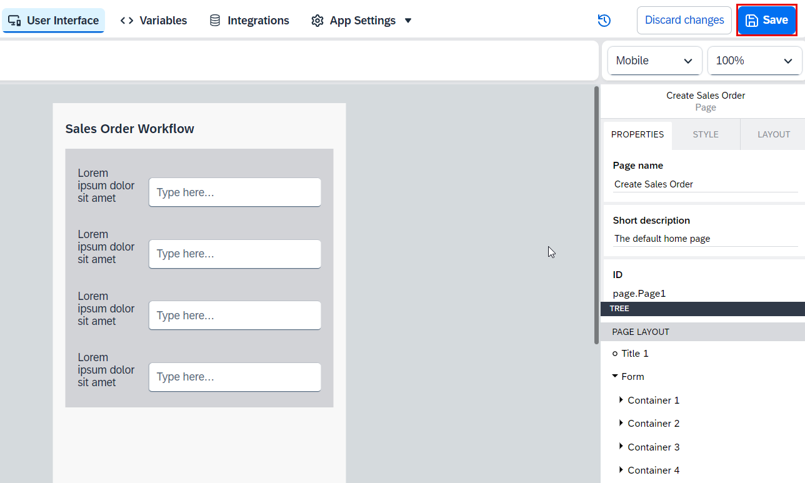

24. Choose on each field label and change it to the following field names, in this order

    | Fields    |
    | --------- |
    | Customer  |
    | Material  |
    | Quantity  |
    | Delivery Date |

25. **Save** your work

    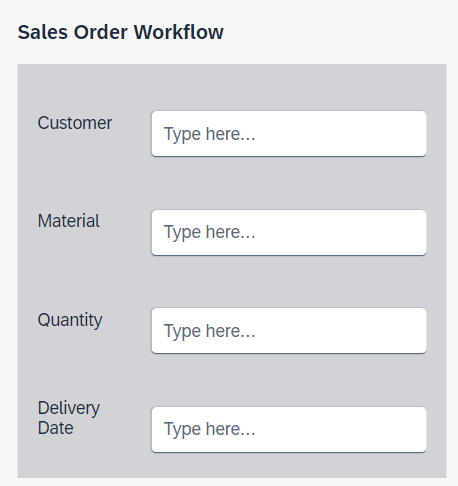

26. At the bottom of the page (outside container 4), add a button.

    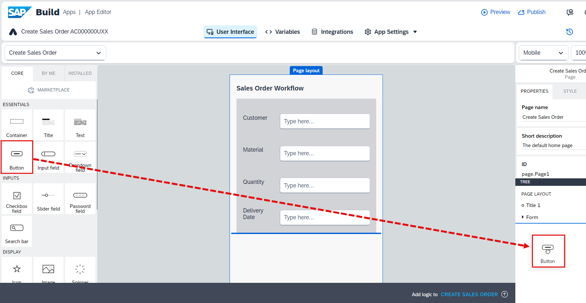

27. In the **Properties** tab, set the **Label** to **Get Approval**

    

28. In the **Style** tab, next to **Primary Button**, Choose the dropdown button and select **Edit**.

    

29. For **Background color** in **SAP MORNING HORIZON CONTENT PALETTES**, select the color **Emphasized**.

    

27. Select **Save** (upper right).

    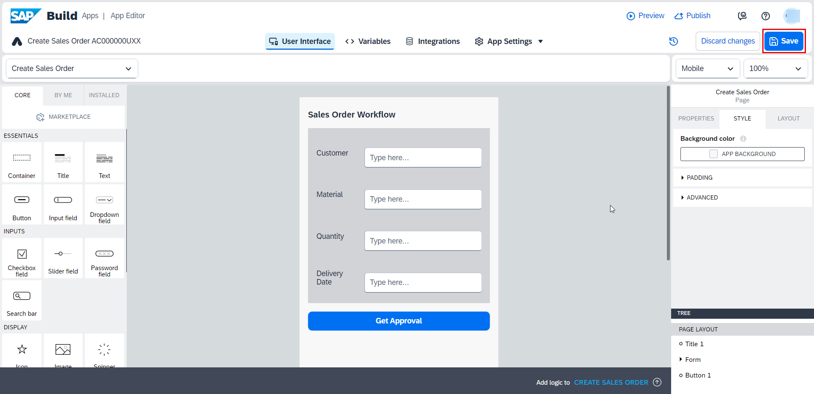
