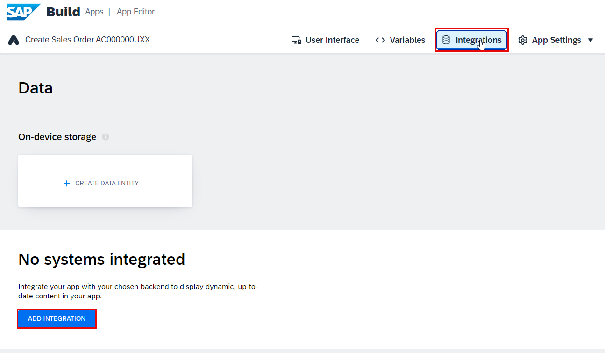
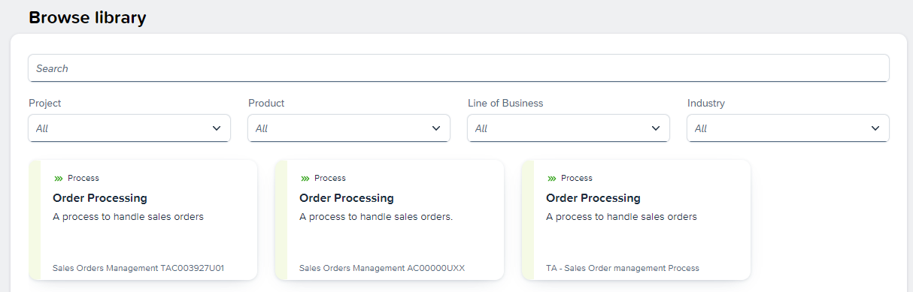
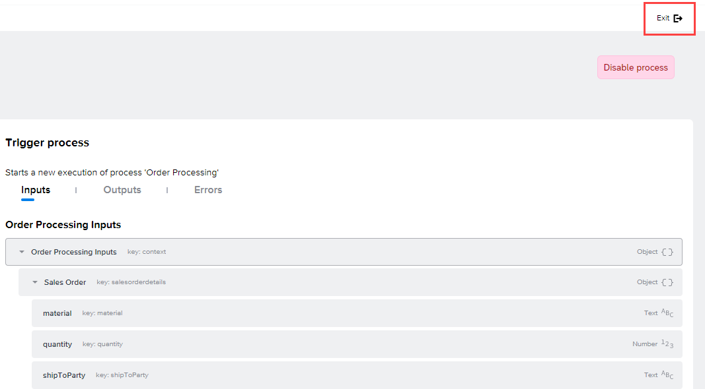

For this workshop, we have already published your SAP Build Process Automation process to the SAP Build Library.

In order to trigger and consume processes from SAP Build Process Automation directly in SAP Build Apps, you need to set up the integration process.

1. Open the **Integrations** tab, at the top of the page.

2. Select **Add Integration**. 

    

3. Choose **SAP Build Library** from the three options.

   

4. You should now see a list of all published processes. 

   

5. Select the process that you want to integrate by choosing on its tile. You need to filter on the **Project Name** for the sales order process in SAP Build Process Automation. 

   If you completed the **SAP Build Process Automation - Create a Sales Order Process** workshop, filter by the **Sales Orders Management XP262-XXX** (your user number) project before selecting the Process. 

   

   Otherwise, filter by the **TA - Sales Order Management Process** project before selecting the Process. 

   

6. Choose **Enable process** to integrate the process.

   

7. Select **Exit**.

   

Now your SAP Build Process Automation process is integrated into your SAP Build Apps project.
