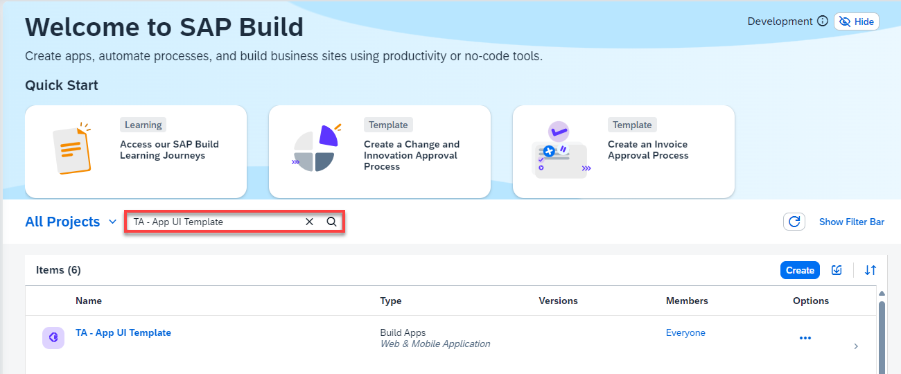
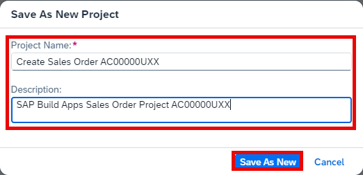

1. Select **[Lobby]({link|https://xp262-tg0x69xc.eu10.build.cloud.sap/lobby})** to access the entry page of **SAP Build**.

2. In the **Lobby**, use the **search** field to locate the project named **XP262 - App UI Template**.

    

3. When you find the template app, select the **Navigate** arrow on the right-hand side.

    

4. Select the **Versions** tab and select the **Options** icon.
   Then choose **Save As New Project**

5. 

6. On the next screen, enter the following:

    | Input Field    | Input Value    |
    | -------------- | -------------- |
    | Project Name   | **Create Sales Order {placeholder\|userid}** |
    | Description    | **SAP Build Apps Sales Order Project {placeholder\|userid}** |

7. Select **Save As New**.

    

Once your project is saved, it should open the **SAP Build Apps editor** automatically, as below. If the project does not open automatically, simply choose your project's name in the lobby. 

You can see the basic components of the UI are already in place:

Because you are using the optional **Copy Template Project** approach, you can now go directly to the **Integration Process** exercise / lesson in this unit (*Create SAP Build App to Trigger Workflow*).

