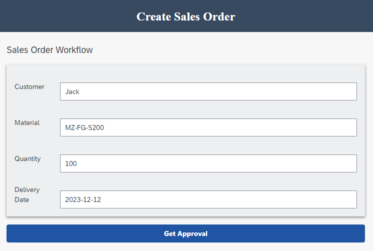

# Create SAP Build App to Trigger Workflow

This tutorial shows you how to use SAP Build Apps to create and stylize a simple, one-page app that triggers an SAP Build Process Automation workflow.

Specifically, the app lets the user enter sales order details and then send these to a process for approval. (In a real-world scenario, the sales order would then be created in S/4HANA Cloud, but that is not part of our flow.)

At the end of this unit, your app will look something like this:

## Script Overview

Use SAP Build Apps to create an app that lets you enter sales order data and then send it to an SAP Build Process Automation approval process via an API call.

> **Note:** Make sure to follow the exercise documentation and use the provided naming conventions. Otherwise, you will encounter issues.

## Prerequisites

- You have access to the SAP Build Apps [Lobby](https://xp262-tg0x69xc.eu10.build.cloud.sap/lobby) with your **XP262-XXX (your user number)** user and Password

## Goal

You will learn how to:

- Create a simple UI
- Create a form
- Stylize your UI
- Trigger from your app a workflow in SAP Build Process Automation

## Further information

- [Product Page](https://www.sap.com/products/technology-platform/no-code-app-builder.html)
- [SAP Discovery Center - Services for SAP Build Apps](https://discovery-center.cloud.sap/serviceCatalog/sap-build-apps?region=all)
- [Tutorials for SAP Build Apps](https://developers.sap.com/tutorial-navigator.html?tag=tutorial%3Atype%2Ftutorial&tag=software-product%3Atechnology-platform%2Fsap-build%2Fsap-build-apps-enterprise-edition)
- [Developer Community for SAP Build Apps](https://community.sap.com/topics/build-apps)