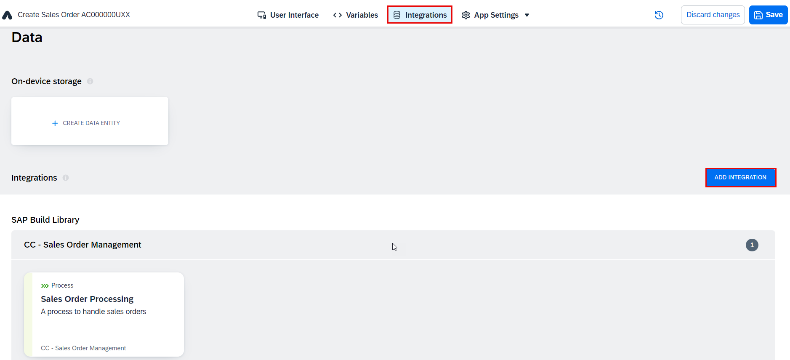
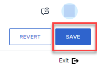

# Populate Dropdown with Material Data from an SAP S/4HANA Cloud Backend

Previously, we created an input box for the user to enter a material ID for the sales order. Now, we want to make a call to an SAP S/4HANA Cloud backend, retrieve product data, and populate a dropdown box so the user can choose from a list of products.

A data resource defines a connection to a backend, and when executed, will bring back the data we want.

1. Go to the **Integrations** tab, and choose **ADD INTEGRATION**.

    

2. Choose **BTP Destinations**.

    

3. Select your **S4HANA_ODATA_Products** destination (use the **Search** box if necessary).

    > **S4HANA_ODATA_Products** refers to a BTP destination that points to the OData ABAP service `/sap/opu/odata/sap/API_PRODUCT_SRV`. This service provides access to product master data, which you can use to populate the product dropdown field in the UI. This ensures seamless integration with the product catalog maintained in SAP S/4HANA, enabling real-time data retrieval and accurate product selection.

    

4. Choose **INSTALL INTEGRATION**.

    

5. Select the **A_ProductDescription** entity on the left, and choose **Enable Data Entity** on the right.

    

6. Choose **Save** (upper right).

    

