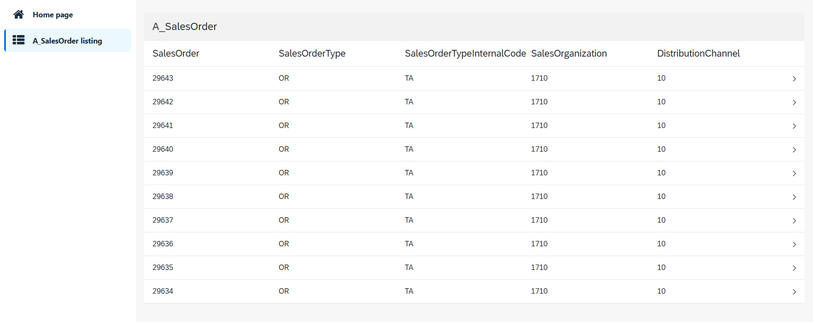
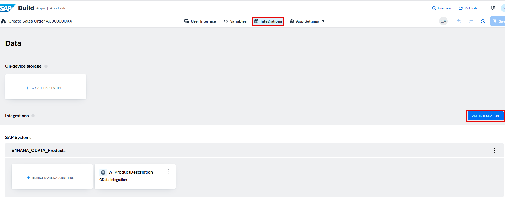
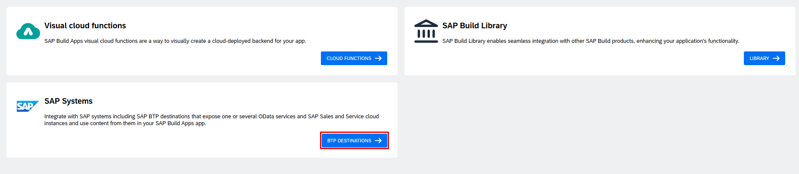
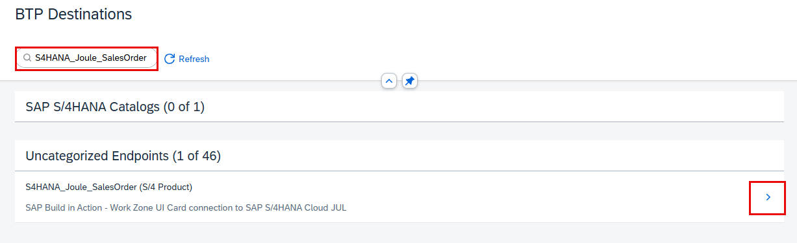
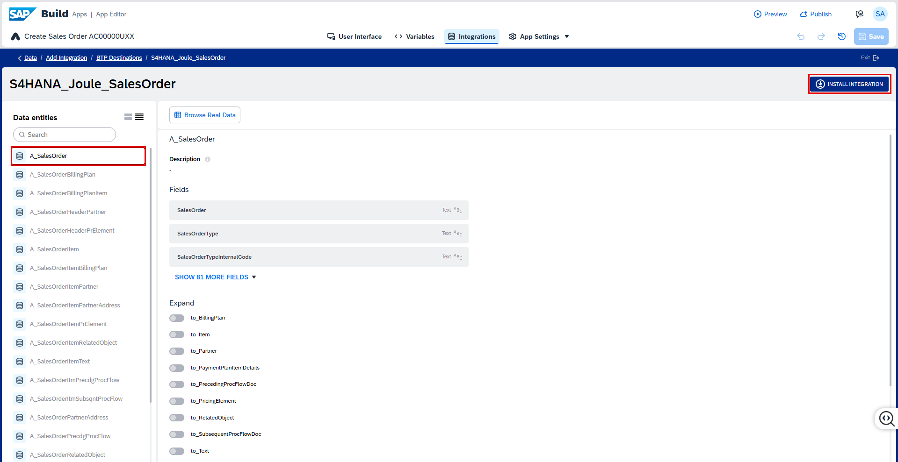
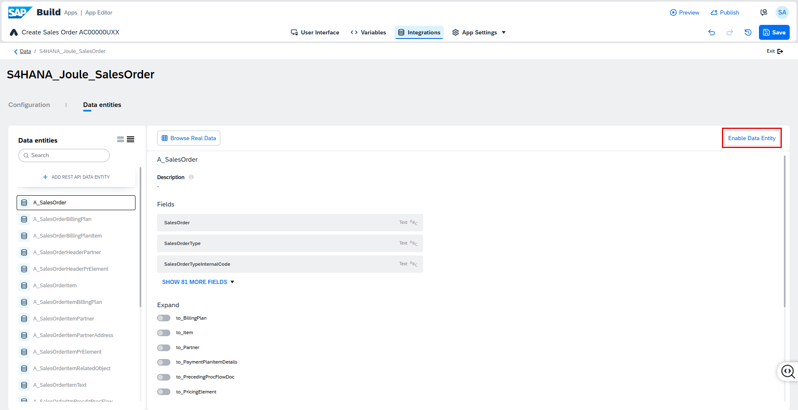
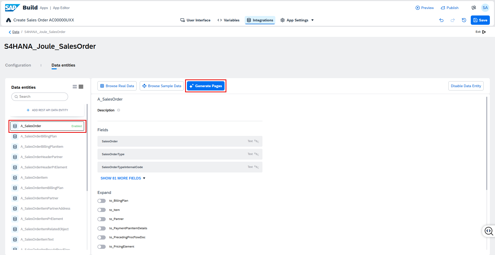
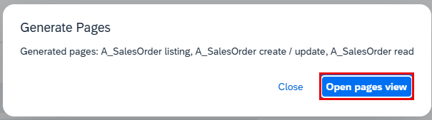
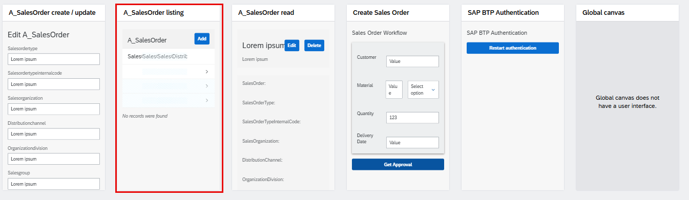
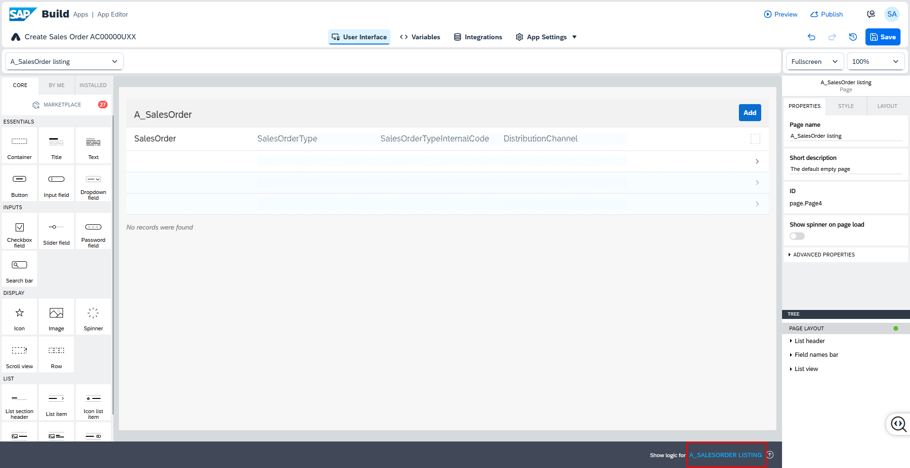

SAP Build Apps includes a **Generative AI assistant** that helps you quickly create fully functional applications based on your backend service metadata.

In this unit, you will use the assistant to generate a **Sales Order Viewer App** using data from an
**SAP S/4HANA** system.

The generated app will include:

* A **List page** displaying sales orders from the A_SalesOrder entity in your backend.

* A **Detail page** showing header-level details for a selected sales order.

   

## Connect to the SAP S/4HANA Backend

1. Select the **Integrations** tab, then choose **Add Integration**.

   

2. In the integration type selection screen, choose **BTP Destinations**.

   

3. Search for and select the destination named **S4HANA_Joule_SalesOrder**.

   

4. The **A_SalesOrder** entity will be preselected. You can review the available fields here. Select **INSTALL INTEGRATION**.

   

5. After installation completes, select **Enable Data Entity**.

   

6. Once the entity is **Enabled**, select **Generate Pages**. SAP Build Apps will now use **Generative AI** to create pages based on the entity metadata.

   

## Inspect the Generated Pages

7. Once generation is successful, select **Open pages view**.

   

8. Here you can see all the pages generated. Select **A_SalesOrder Listing** to configure filters or review its design.

   

9. Click on show logic for **A_SALESORDER LISTING** to view the generated logic flow.

   

