In this lesson, you’ll configure **filtering**, **ordering** and **paging** for both the **Get Record Collection** logic node and the **A_SalesOrder** data variable. This improves performance and ensures only the most relevant data is retrieved.

>Note: Since this is a live SAP S/4HANA OData service, it may return a large volume of Sales Orders.
To ensure optimal performance and relevant results, you will retrieve only the latest entries.

## Get Record Collection Logic Node

1. In the logic flow, select the **Get Record Collection** node to open its properties.

   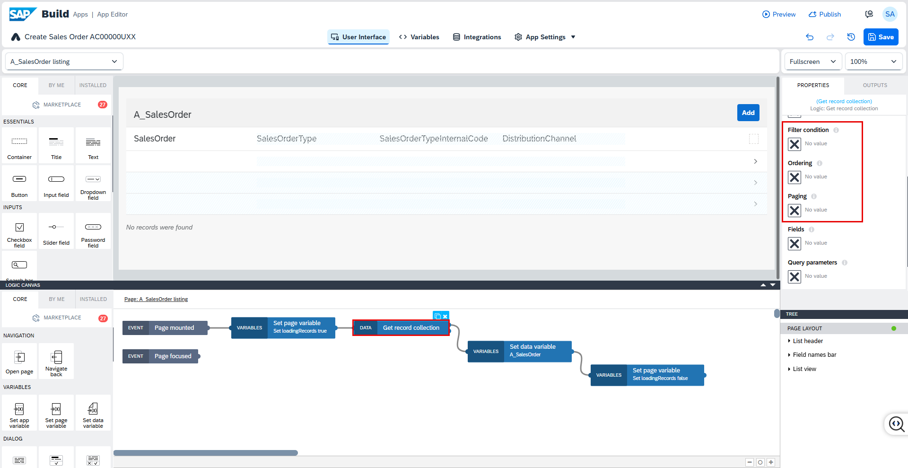

### Filtering

2. Under **Filter condition**, select the **X** icon, then choose **Object with properties**.

   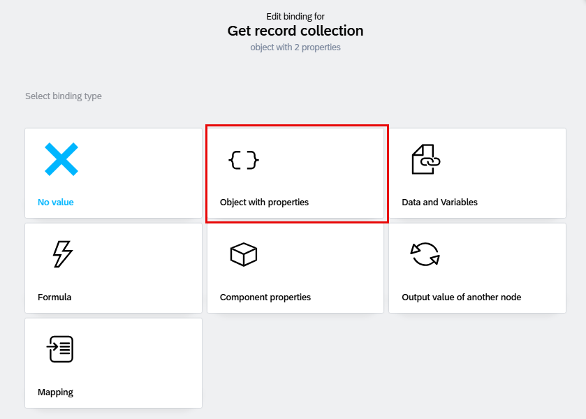

3. Select **ADD CONDITION**: 
  * **Property:** **SalesOrganization**
  * **Condition Type: equal**
  * **Compared value: 1710** 
  
  
4. Select **ADD CONDITION**: 
  * **Property:** **SalesOrderType**
  * **Condition Type: equal**
  * **Compared value: OR** 

 Click **SAVE**.

   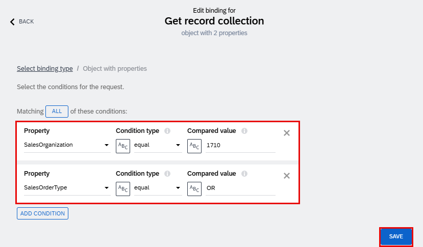

### Ordering

5. Under **Ordering**, select the **X** icon, then choose **List of values**.

   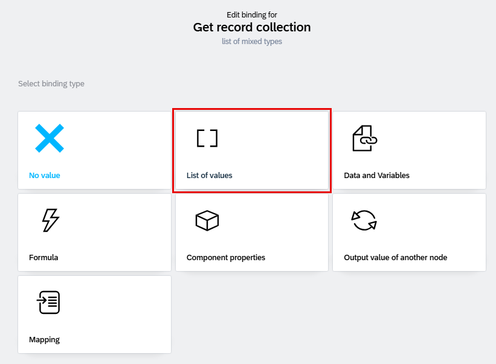

6. Select **ADD SORT OPTION**:

  * **Property: SalesOrder**
  * **Order: descending**
  This ensures the most recent Sales Orders appear first.

Click **SAVE**. 

   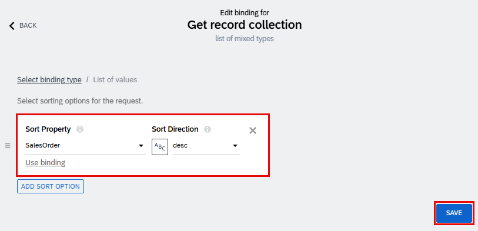

### Paging

7. Under **Paging**, select the **X** icon, then choose **Object with properties**.

   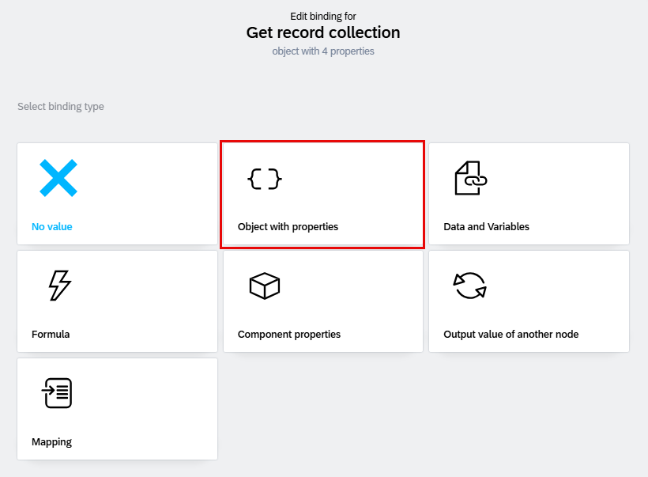

8. Here we will set two mandatory values: 

* **Page size**
* **Include total count**

   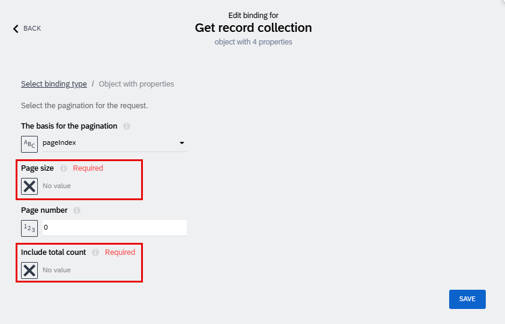

9. Under **Page size**, select the **X** icon, then choose **Static Number**.

   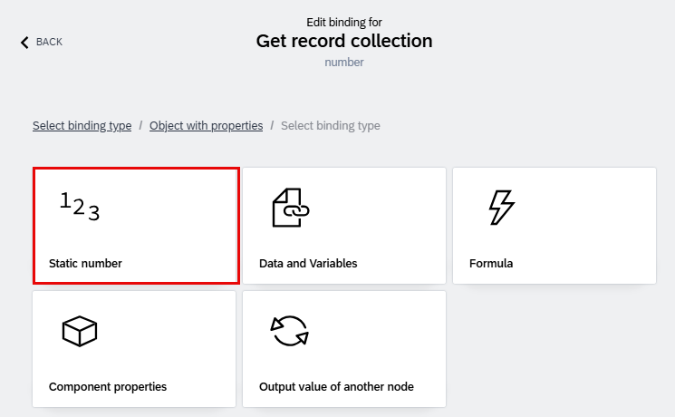

10. Enter **10** as the page size. This will fetch only 10 records at a time.

   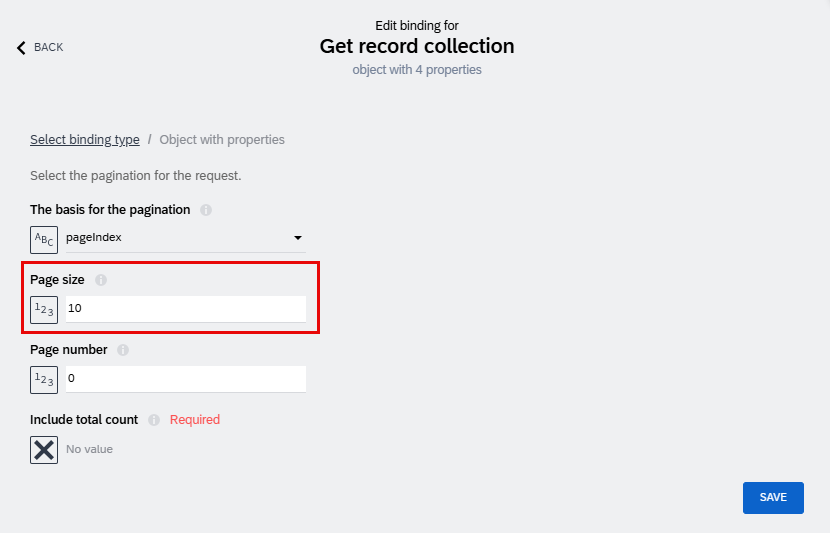

11. Under **Include total count**, select the **X** icon, then choose **Static true/false**.

   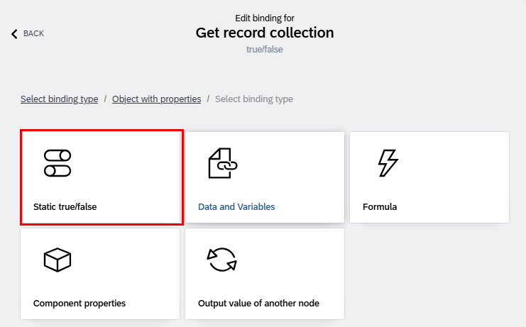

12. Set the value to **false**, then click **SAVE** to confirm both paging settings.

   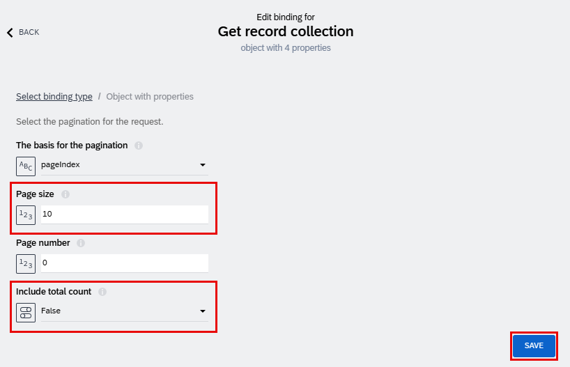

13. **Save** your work. Now close the logic screen by clicking on downward arrow.

   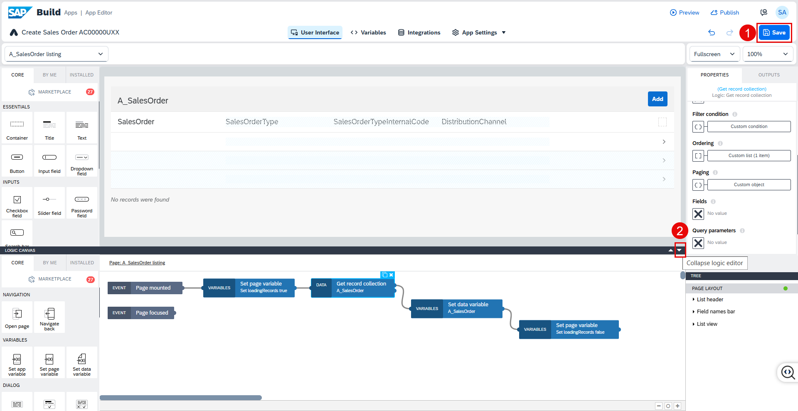

## A_SalesOrder Data Variable

1. Go to **Variables > DATA VARIABLES > A_SalesOrder**. To the right of the screen are the properties for this data variable.

   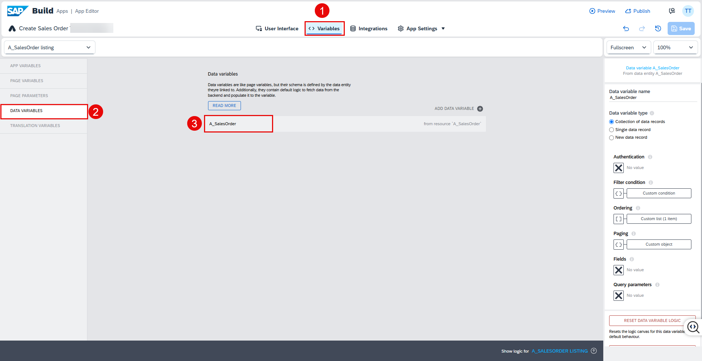

### Filtering

2. Under **Filter condition**, select the **X** icon, then choose **Object with properties**.

   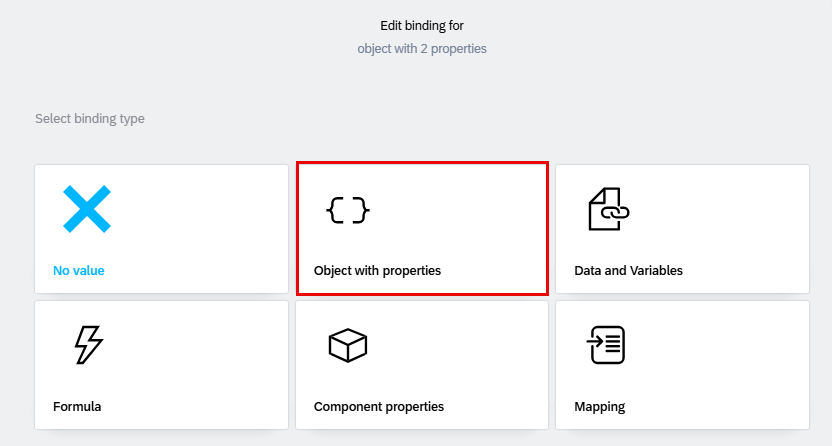

3. Select **ADD CONDITION**: 
  * **Property:** **SalesOrganization**
  * **Condition Type: equal**
  * **Compared value: 1710** 
  
  
4. Select **ADD CONDITION**: 
  * **Property:** **SalesOrderType**
  * **Condition Type: equal**
  * **Compared value: OR** 

 Click **SAVE**.

   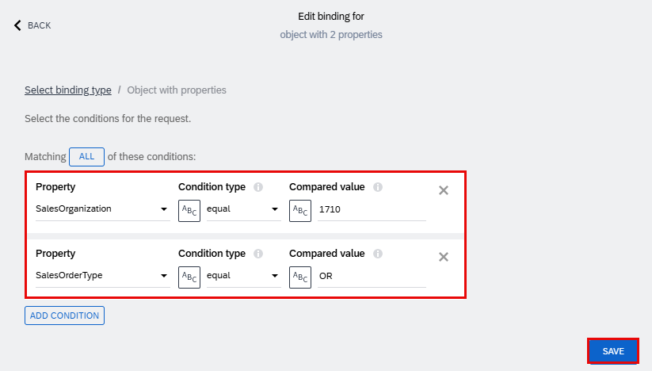   

### Ordering

5. Under **Ordering**, select the **X** icon, then choose **List of values**.

   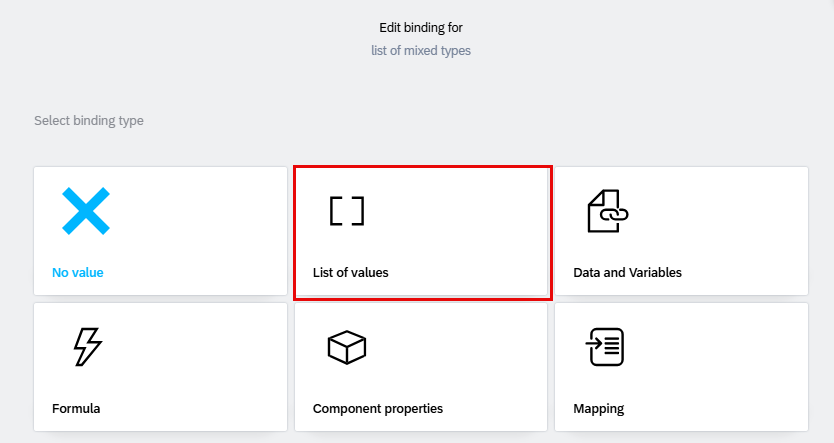

6. Select **ADD SORT OPTION**:

  * **Property: SalesOrder**
  * **Order: descending**
  This ensures the most recent Sales Orders appear first.

Click **SAVE**. 

   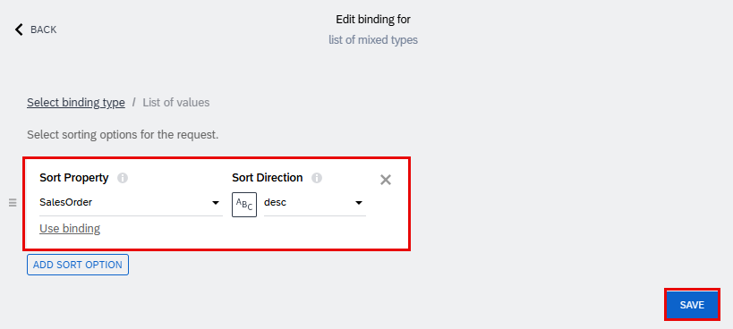

### Paging

7. Under **Paging**, select the **X** icon, then choose **Object with properties**.

   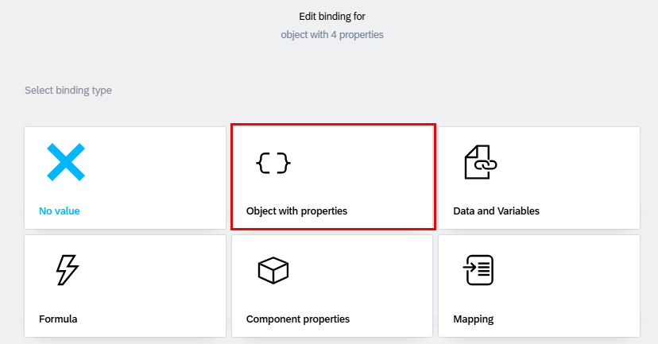

8. Here we will set two mandatory values: 

* **Page size**
* **Include total count**

   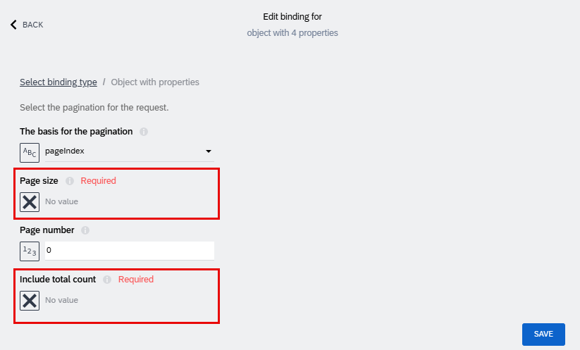

9. Under **Page size**, select the **X** icon, then choose **Static Number**.

   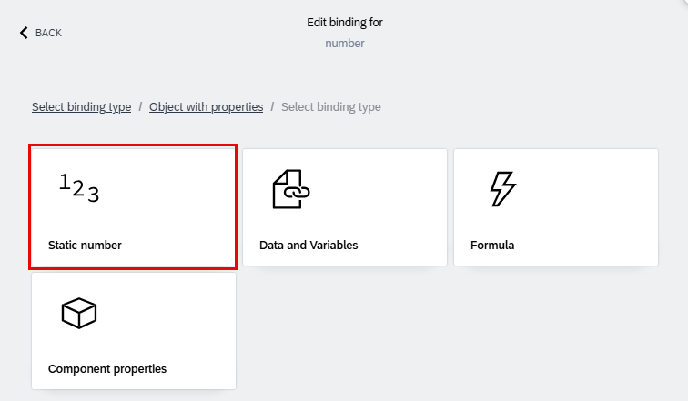

10. Enter **10** to limit the results to 10 records per query

   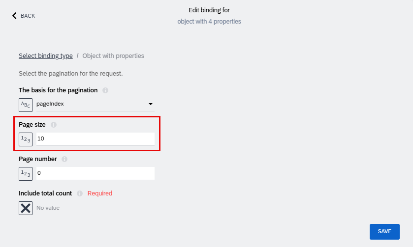

11. For **Include total count**, select the **X** icon, then choose **Static true/false**.

   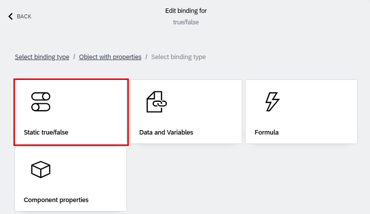

12. Set the value to **false**, then click **SAVE** to confirm both paging settings.

   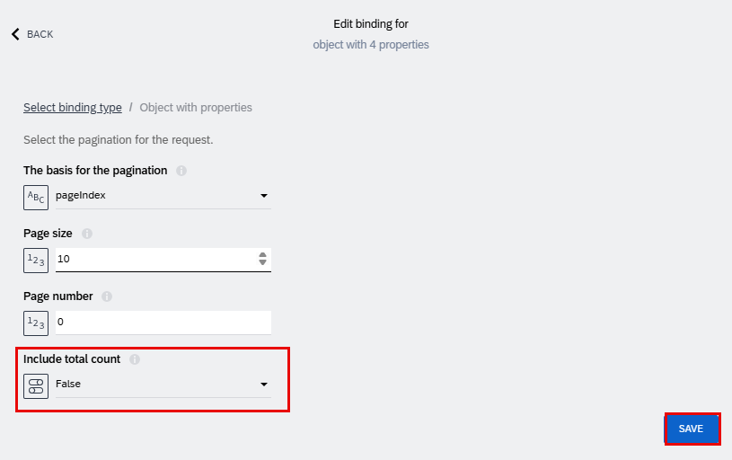

13. **Save** your work. Select the **User Interface** tab..

   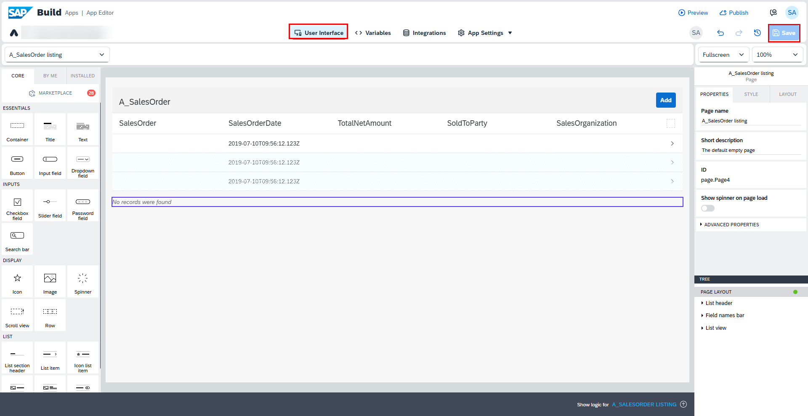

