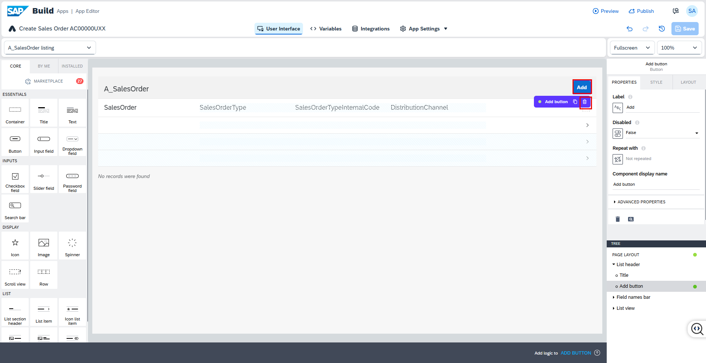
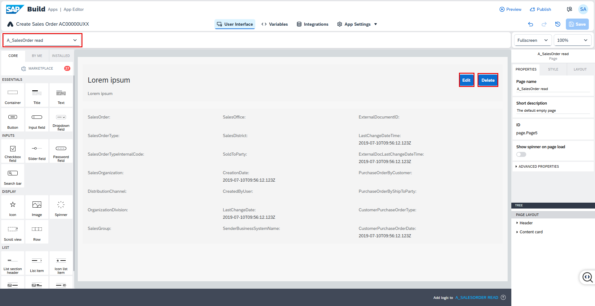
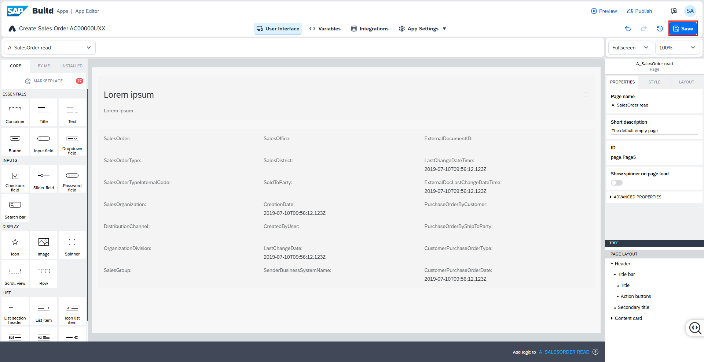

1. Delete the **Add** button from the list page. 

This functionality is not needed for this app, as you have already created a separate SAP Build Apps project for posting Sales Orders to SAP S/4HANA.

   

2. Switch to the **A_SalesOrder read** page. Delete the **Edit** and **Delete** buttons.

   

3. **Save** your work.

   
