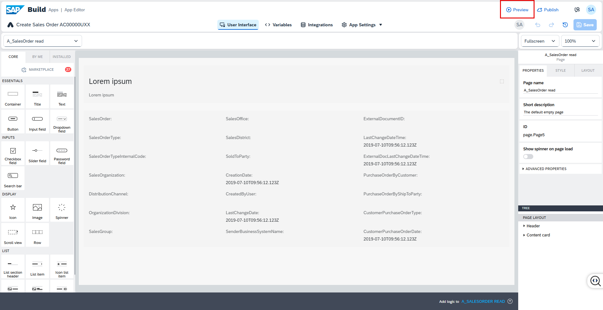
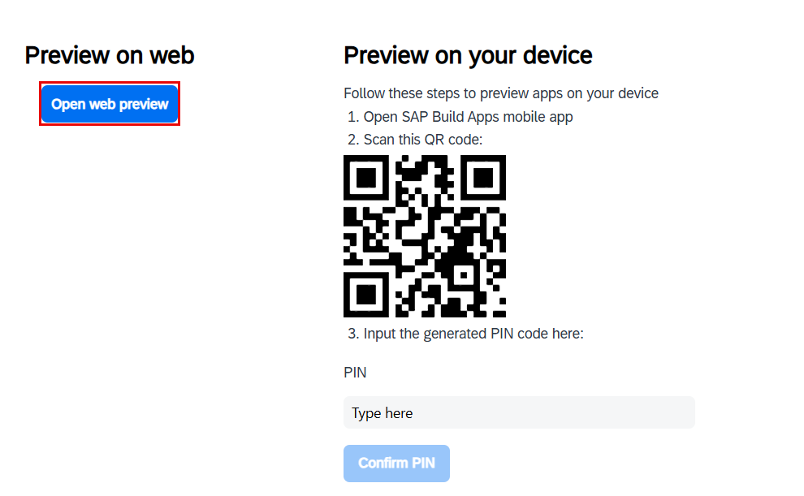
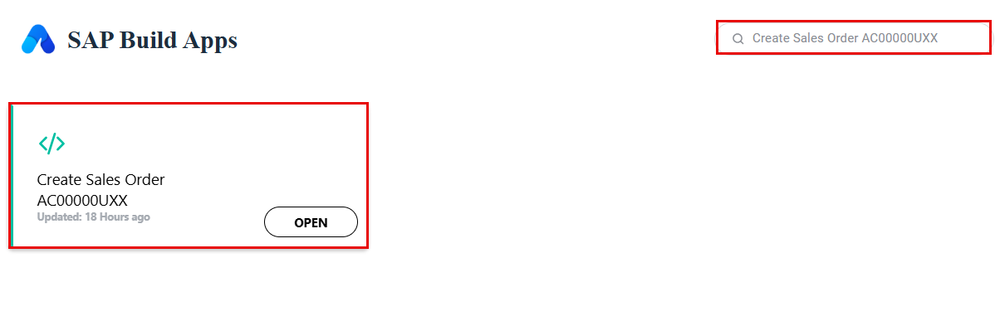
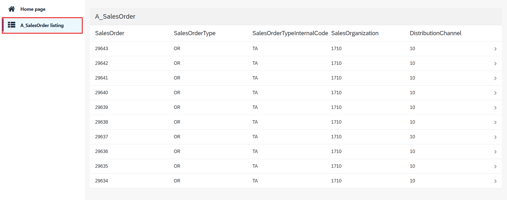
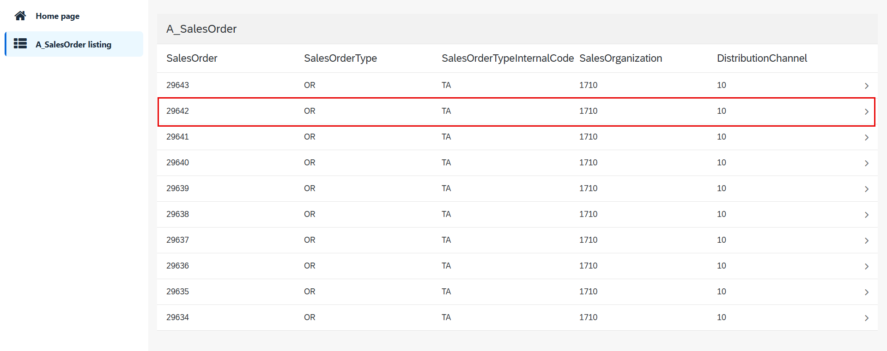
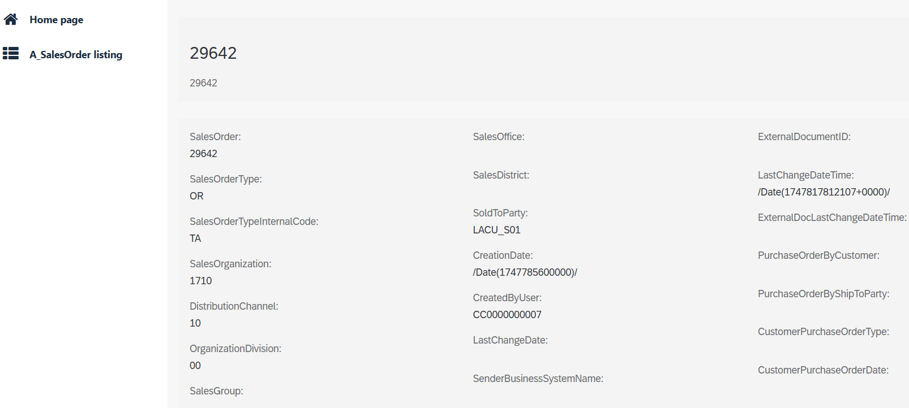

1. Select **Preview** from the top-right corner of the screen.

   

2. You can choose to preview the app in a web browser or using the mobile app. For this exercise, select O**pen web preview**.

   

3. In the preview launcher, select your project — for example: **Create Sales Order {placeholder|userid}**.

   

4. Once the app loads, choose the **A_SalesOrder Listing** page to view the latest 10 Sales Orders, based on the filters you configured.

   

5. Select any Sales Order row in the list to open the corresponding detail view.

   

6. The details page will now display the selected Sales Order’s information.

   
