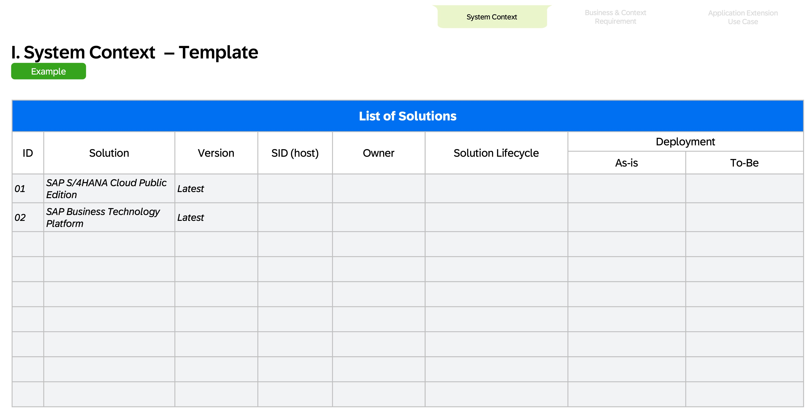

# Exercise 1 - SAP Application Extension Methodology

In this exercise, you'll assume the role of an Enterprise Architect. You’re a member of ACME Corporation’s Enterprise Architecture team, tasked with creating a target solution diagram to prepare for the implementation of this extension use case. Having recently learned about the SAP Application Extension Methodology, you plan to apply it to guide the architecture of this project.

## Exercise 1.1: Use case example: Sales order process extension

### Your Role and Task:
You’re a member of ACME Corporation’s Enterprise Architecture team, tasked with creating a target solution diagram to prepare for the implementation of this extension use case. Having recently learned about the SAP Application Extension Methodology, you plan to apply it to guide the architecture of this project.

### Business Case

The sales department at ACME Corporation has specific requirements for its end-to-end lead-to-cash sales order process - specifically for sales order data entry and the approval workflow. The Cloud ERP will remain the system of record for sales orders. A fit-to-standard workshop concluded these requirements cannot be met with SAP standard applications. Because the custom process offers a competitive advantage, ACME’s leadership approved its development on the condition that it follows the Clean Core strategy.
A custom sales order entry app on SAP BTP validates input and posts orders to the Cloud ERP using standard APIs. The UI displays customer, product, quantity, and delivery date. Product data is retrieved from the Cloud ERP. An internal sales representative enters the order details and triggers the automated approval workflow.
ACME’s sales order entry requires additional validations and approvals. The automated approval workflow is triggered when the quantity exceeds defined thresholds (e.g., >10). All these scenarios require approval from the Sales Manager. The solution must include two forms — "Sales Order Approval" and "Sales Order Rejected" — each displaying product, quantity, customer name, expected delivery date, and a free-text message field for the buyer.

### Architecture Principals and Business Context:
- Extensions needs to be upgrade stable and follow Clean Core Level A
- SAP Build Low-code/No-code tools are preferred for development (?Citizen Developer?)
- Side-by-Side options are preferred for workflow implementation and UIs
- ACME employees are used to access SAP application through SAP Build Work Zone

## Exercise 1.2: SAP Application Extension Methodology - Phase 1: Assess Extension Use Case

### Task:
1. Learn about the SAP Application Extension Methodology - [Phase 1: Assess Extension Use Case](https://help.sap.com/docs/sap-btp-guidance-framework/sap-application-extension-methodology/phase-1-assess-extension-use-case?locale=en-US)
2. Take a look at the sample solution for System Context, Business Context & Requirement, and Application Extension Use Case. To speed up the workshop we already provide you with the solution. In later exercises you will fill out the templates on your own.

### System Context

Click to expand

### Business Context & Requirement

Click to expand

### Application Extension Use Case

Click to expand

## Exercise 1.3: SAP Application Extension Methodology - Phase 2: Assess Extension Technology

## Summary

You've now ...

Continue to - [Exercise 2 - Exercise 2 Description](../ex2/README.md)

