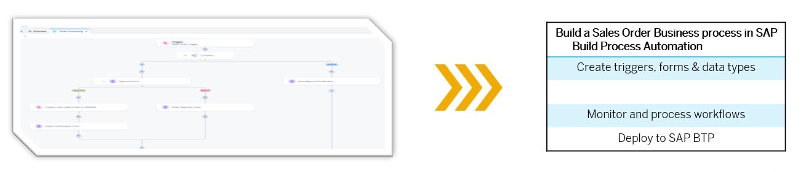

# Overview of the Sales order Process for SAP Build Process Automation

With SAP Build Process Automation, create a sales order approval process that can be triggered with an API call, and then run it by sending the sales order details in the API call.

## Prerequisites

- Your **XP262-XXX (your user number)** username and password
- You have access to the SAP Build [Lobby](https://xp262-tg0x69xc.eu10.build.cloud.sap/lobby). 

> Make sure to follow the exercise documentation and use the provided naming conventions. Otherwise, you will encounter issues. 

## Goal

You will learn

- How to create a SAP Build Process Automation project to build and extend business processes

## Next step

Click here to start the next step: [Create Process](../2_SAP-Build_E2E_Automation_Create-Process/1_Automation_Create-Process.md)

## Further information

- [Product Page](https://www.sap.com/products/technology-platform/process-automation.html)
- [SAP Discovery Center - Services for SAP Build Process Automation](https://discovery-center.cloud.sap/viewServices?category=processautomation)
- [Developer Community for SAP Build Process Automation](https://community.sap.com/topics/process-automation)
- [SAP Builders Interest Group](https://groups.community.sap.com/t5/sap-builders/gh-p/builders)

