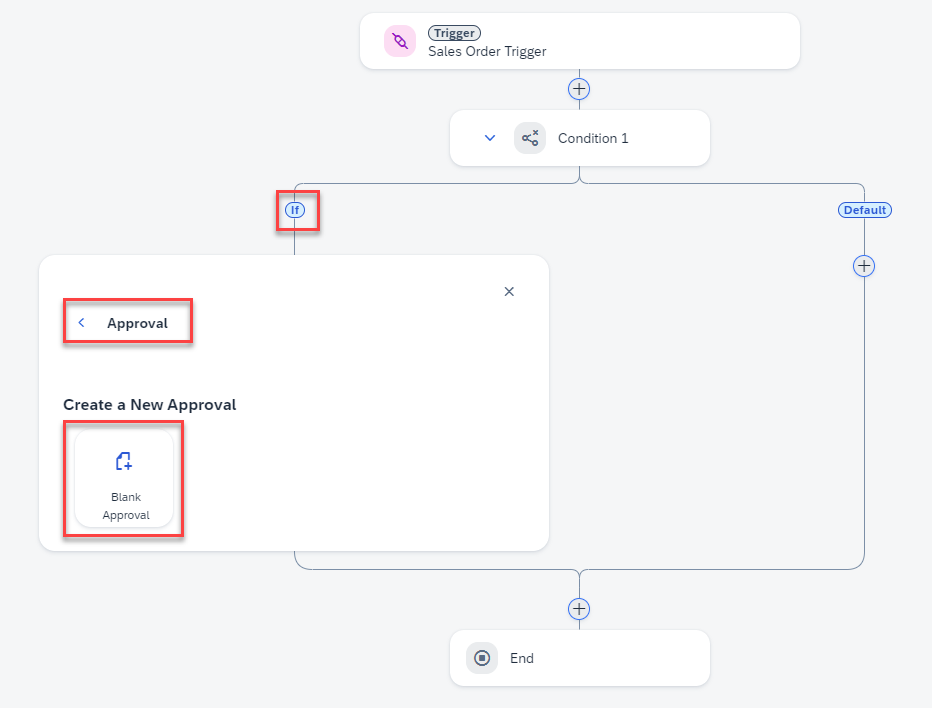
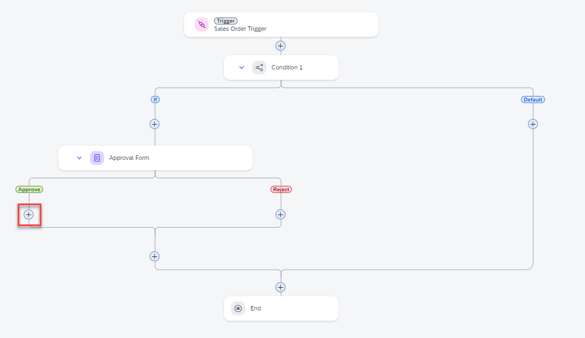

### Create and Configure the Approval Form.

Navigate back to the Process Builder canvas to create an Approval Form.

1. On the **If** branch, choose on **(+)** > **Approval** > **Blank Approval**.

   

2. Enter the name as **Approval Form** and click **Create**.

   

3. Select **Approval Form**, and under **General**, Select **Open Editor**.

   

   

4. Design the form by dragging and dropping the corresponding form elements as shown below.

   | **Form Fields Type**                                          | **Form Field Value**                | **Configuration (Read Only)** |
   | -------------------------------------------------------------- | ----------------------------- | ----------------------------- |
   | Headline1                                                      | Approve Sales Order       |                               |
   | Paragraph                                                      | A new order has been received. Please review and confirm whether the requirements can be met or not. |                               |
   | Text                          | Material                                                     | X                             |
   | Number                        | Quantity                                                     | X                             |
   | Text                          | Customer Name                                                | X                             |
   | Date                          | Expected Delivery Date                                       | X                             |
   | Checkbox                      | I acknowledge that we have received your order and will process it based on the availability |                               |
   | Text Area                     | Message to Buyer                                             |                               |

   >The Approval form should be the same as below.

   

5. To save the form, choose **Save** .

6. Back within the process, click on the **Approval Form** and configure the **Subject** and **Recipients**.

   In the **Subject** section:

   - Enter the subject as: **Please review the**
   - Map the **material** from the **salesorderdetails** Process Content popup to **Subject**.
   
   In the **Recipients/Users** section: 
   
   - Enter **xp262-XXX@education.cloud.sap** (replace XXX with your user number)

   

7. Configure the **Inputs** of **Approval Form**. 

   Navigate to **Inputs** and map the fields accordingly.

   See below:

   

8. **Save** your work. You should see the following.

  

### Create and Configure the Order Approval Notification Form.

1. After **Approve**, choose **(+)** 

   

2. Choose on **Form** >**Blank Form**.

   

3. Enter the name as **Order Confirmation Form** and choose **Create**.

   

4. Choose **Open Editor** under the **General** tab.
> Make sure you have selected **Order Confirmation Form**.

   

5. Design the form by dragging and dropping the corresponding Form elements as shown below.

   | **Field type**  | **Field Value**                                                | **Configuration (Read Only)** |
   | --------------- | -------------------------------------------------------------- | ----------------------------- |
   | Headline 1      | Order Confirmation                                           |                               |
   | Paragraph       | Your order has been received and accepted for delivery. We will send you the details as soon as the order is shipped. You can find the details of your order below, please review and verify your request: |                               |
   | Text Area       | Message from the supplier:                                   | X                             |
   | Text            | Material                                                     | X                             |
   | Text            | Customer Name                                                | X                             |
   | Number          | Quantity                                                     | X                             |
   | Date            | Expected Delivery Date                                       | X                             |
   | Paragraph       | Please press the SUBMIT button to acknowledge the order status. |                               |

6. To save the form, choose **Save**.

   

7. Configure the **Subject** and **Recipients**. Back in the process, choose the **Order Confirmation Form**.

   In the **Subject** section:

   - Enter: **Your order has been approved for**
   - Map **material** from the **salesorderdetails** Process Content pop-up to the **subject field**

   In the **Recipients/Users** section:
   
   - Enter **‚xp262-XXX@education.cloud.sap** (replace XXX with your user number)

8. To save your work, choose **Save**.

   
  
9. Configure the inputs of **Order Confirmation Form**.

   Navigate to **Inputs** and map the fields accordingly.

   See below:

   

10. Choose **Save** to save your work.

## Next step

Click here to start the next step: [Reject Notification](../2_SAP-Build_E2E_Automation_Create-Process/4_Automation_Create-Process.md)