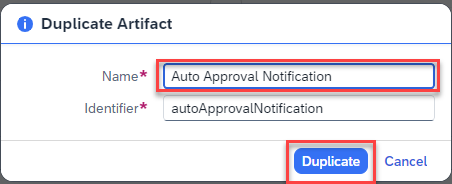

### Create and Configure the Auto Approval Notification Form.

In this step, you will create a notification form which would be received by the supplier if the order is approved automatically.

1. To add the new form, you will use the **Duplicate** feature. 

2. Select the **Overview**.

   - Find **Order Confirmation Form** under the Artifacts section and select three dots **(…)**.
   - Choose **Duplicate**.

   

3. In the duplicate artifact pop-up window, change the name to **Auto Approval Notification** and **select** **Duplicate**.

   

   > The form is automatically opened in the form builder. Change the auto approval form in the form builder to reflect the data for auto approval use case.

   Design the notification form, the same way as in the previous steps, to send another notification to the requester about auto-approval.

   Modify the **Layout fields**:

   | **Form Fields** | **Field Settings with Label**                                    | **Configuration(Read Only)** |
   | --------------- | ---------------------------------------------------------------- | ---------------------------- |
   | Headline 1      | Automatic Order Confirmation                                   |                              |
   | Paragraph       | Your order has been received and we will send you the details as soon as the order is shipped. You can find the details of your order below, please review and verify your request: |                              |
   | Paragraph       | Your Sales Order Details:                                      |                              |
   | Text            | Material                                                       | X                            |
   | Number          | Quantity                                                       | X                            |
   | Text            | Customer Name                                                  | X                            |
   | Date            | Expected Delivery Date                                         | X                            |
   | Paragraph       | Please press the SUBMIT button to acknowledge the order status |                              |

   

4. To save your work, choose **Save**.

5. Go back to the Process Builder canvas (the *Order Processing* tab) and add the **Auto Approval Notification** form below the **Default** node.

   

6. Choose **(+)** choose **Form** then **Auto Approval Notification**.

   

7. Configure the **General** section.

8. Under Subject:

   - Enter the text: **Your order has been automatically approved for**  

   - Map **material** from **Process Content** => **salesorderdetails**.

9. Under **Recipients/Users**:
    Enter **XP262-XXX@education.cloud.sap** (replace XXX with your user number)

10. To save your work, choose **Save**.
   

11. Configure the **Inputs** section.

      | Form Input Fields      | Process Content Entry  |
      | ---------------------- | ---------------------- |
      | Customer Name          | shipToParty          |
      | Expected Delivery Date | expectedDeliveryDate |
      | Material Name          | material             |
      | Quantity               | quantity             |

   

12. To save your work, choose **Save**. Your final process looks as below.

   

This completes the process design with condition criteria that will decide what process flow is executed and whether there will be an auto-approval or a one-step approval route.

## Next step

Click here to start the next step: [Run Process](../ex2-SAP_Build_Process_Automation/3_SAP-Build_E2E_Automation_Run-Process/README.md)

