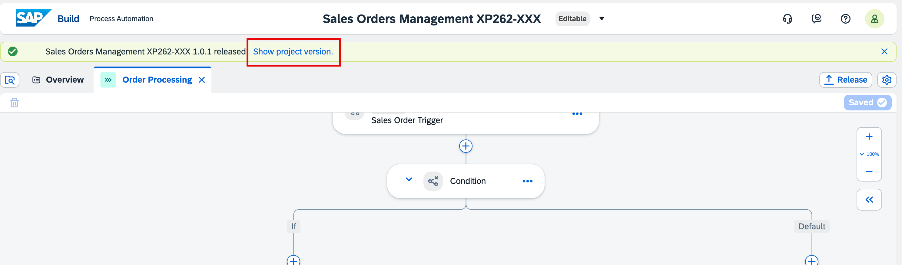
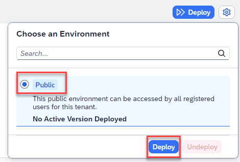
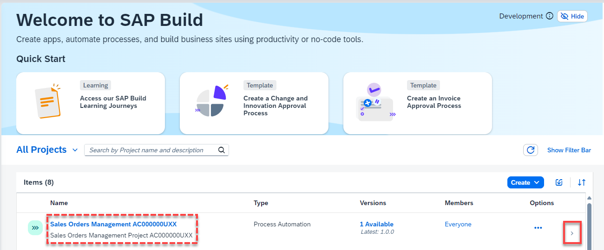

### Release the Business Process Project.

To run the process, you have to first release and then deploy the business process project.

Releasing a project creates a version or snapshot of the changes, and deploying the project makes it available in runtime to be consumed. You can only deploy a released version of the project.

1. In the Process Builder, to release a project, Choose **Release** button on the top-right corner of the screen and provide a description in the popup dialog.

   

   > Every time you release, a new version will be created. The version is incremented automatically based on how you want to store the changes in the repository like major or minor update or just as a patch.

   If you are releasing for the first time, then the version will start with **1.0.0**. Next time you release, the version numbers will be automatically updated.

2. Choose the **Release** button.

   

### Deploy the Released Project.

1. Once the project is released successfully, you can see all project version that exists.

   

2. Now choose the **Deploy** button on the top-right corner of the screen.

   

   **Note**: If you do not see the **Deploy** option you may ned to manually change from the **Editable** to the **Released** version of your project:
   

3. Select the **Public** environment and Choose **Deploy**. You can ignore the depracation message.

   

4. Choose **Deploy**.

   

5. Once the deployment is successful, you will see a changed status.

   

   > You cannot edit released or deployed projects. To continue working on your project, you need to select the Editable version of your project (at the top of the page).

### Publish to the SAP Build Library.

1. After you have released and deployed the process, go to the SAP Build Lobby and find your project (i.e. **Sales Orders Management XP262-XXX (your user number)**).

2. Once you have found the process with at least one available version, Choose the **Navigate** arrow on the right.

   

3. Select the **Versions** tab, locate your **Deployed** version, and select the **Publish to Library** icon.

   

4. Select the version (you may use the most recent version - if several versions are available) and choose the **Publish** button. Afterwards, your process is ready to run.

   

You have successfully released, deployed, and published your process. Now, your process will be visible from other SAP Build products in the SAP Build Library section. It is time to test the process and see the results.

## Next step

Click here to start the next step: [Run process](../3_SAP-Build_E2E_Automation_Run-Process/2_Automation_Run-Process.md)
