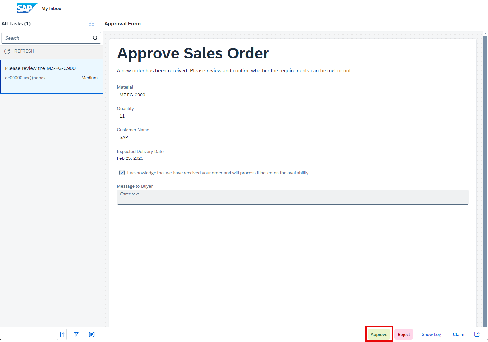

### Monitoring the Process Flow

Monitoring business process is one of the key aspects of the automated processes. Technical monitoring is an administrator job where a process admin proactively and consistently monitors the process performance, identifies any issues in the process, and takes necessary actions to ensure business process continuity.

**SAP Build** provides different applications to monitor and manage different process artifacts. These applications are available under the **Monitor** tab.

1. Earlier, we accessed **Processes and Workflows** under the **Manage** section to see all the deployed processes.

   To monitor all the running instances of the process, you must go to **Process and Workflow Instances** under the **Monitor** section.

   

   There, you will see all the running, erroneous and suspended process instances. Use the filter bar to get a more customized view of the process instances based on different statutes like running, completed, suspended, terminated, and so forth.

   The best way to find your process is to search for your user number or initials, depending on how you named it.

2. Search for the project **Sales Orders Management **XP262-XXX (your user number)**** using the Project dropdown. All the instances of the selected project are displayed in the table below. Select the latest one as it was the one created in the previous lesson.

   > Explore different process monitoring options. Observe the process instance information, the process context which is the actual process data flowing across different activities in the process, and the execution logs where you can see the entire trace of how the process has been progressing with some basic runtime information of each activity.

   Because the quantity is greater than 10, the process requires an approval. You can check the Logs and Context for this instance.

   

3. As you can see the process is waiting for the task to be completed. These tasks are generated from the forms that are added in the process and can be accessed via the **My Inbox** application.

4. Choose on the icon on the top right corner to open the **My Inbox** application.

   

### Accessing the Tasks

1. Tasks are the request for the users to participate in an approval or review process. These tasks appear in the **My Inbox** application shipped with **SAP Build**. Users can claim, approve, and reject the task from their inbox. You can add a message to the buyer.

2. Choose **Approve**.

   

3. Once you **Approve/Reject** the approval task, an API call will be triggered to S/4HANA Cloud system to create a sales order.

4. **Refresh** the inbox again to get the notification of Order Confirmation with the created sales order in the system.

   Choose **Submit** to acknowledge the order and complete the process.

   

4. Once you acknowledge the notification sent via the approval process, the process will be completed.
  
   The Logs can be seen in the **Monitor** section.

   

**Congratulations** you finished the SAP Build Process Automation Part. As a next step we will create a custom user interface with SAP Build Apps.

## Next step

Click here to start the next step: [SAP Build Apps](.../ex3-SAP_Build_Apps/1_SAP-Build_E2E_BuildApps-Overview/README.md)
