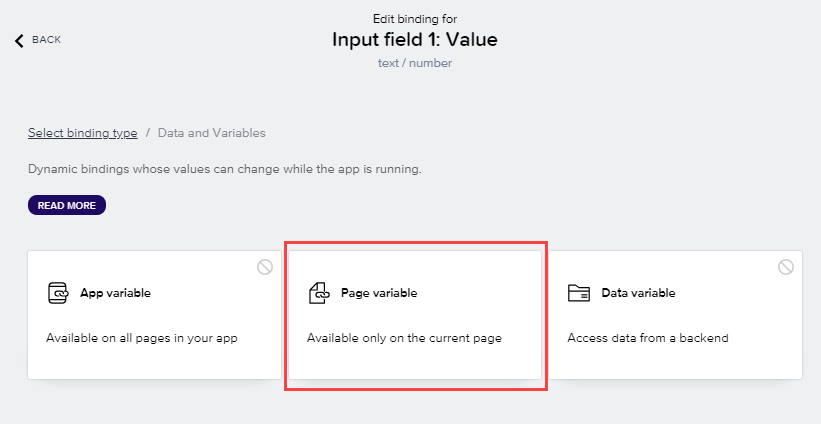

We created page variables for the sales order data, but now we need to get the data entered by the user into the respective variable. We do this by binding each page variable to their respective UI elements, specifically, to the input boxes.

Whenever someone types into the input box, the value is automatically copied into the corresponding page variable.

1. Select **User Interface**.

    

2. Using the **TREE** structure, choose on the first input field (for **Customer**).

3. In the **Properties** tab, choose the **X** next to the **Value** field

    

4. Select **Data and Variables** > **Page variable** ... 

    

5. Select **customer**.

6. Select **Save**

    

7. Using the **TREE** structure, choose on the second input field (for **Material**).

     In the **Properties** tab, choose the **X** next to the **Value** field, and select **Data and Variables > Page Variable > material**.

8. Select **Save**

     

9. Using the **TREE** structure, choose on the third input field (for **Quantity**).

    In the **Properties** tab, choose the **X** next to the **Value** field, and select **Data and Variables > Page Variable > quantity**.

10. Select **Save**

    

11. Using the **TREE** structure, choose on the fourth input field (for **Delivery Date**).

    In the **Properties** tab, choose the **X** next to the **Value** field, and select **Data and Variables > Page Variable > date**.

12. Select **Save**

    

13. Select **Save** (upper right).

## Next step

Click here to start the next step: [Logic](../ex3-SAP_Build_Apps/2_SAP-Build_E2E_BuildApps-Workflow/5_BuildApps-Workflow.md)