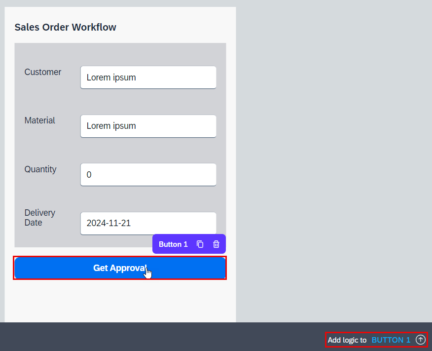
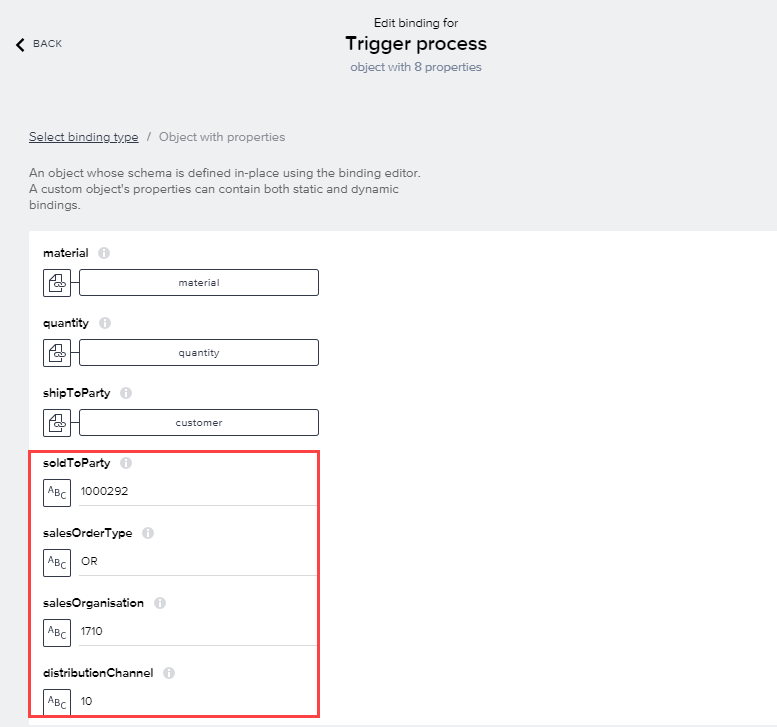
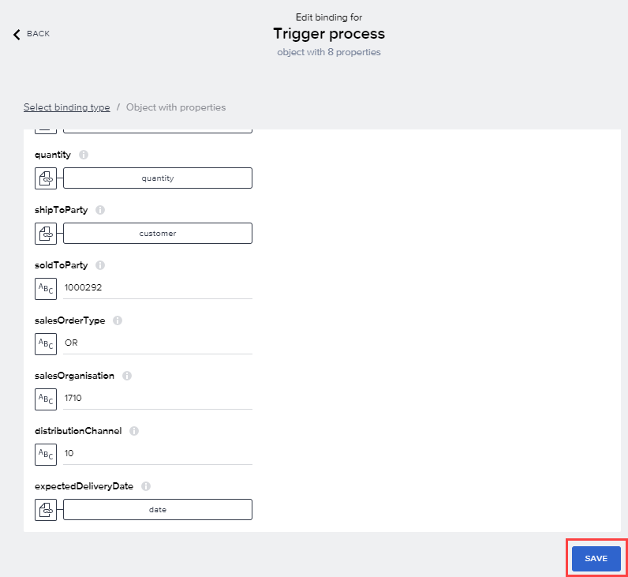
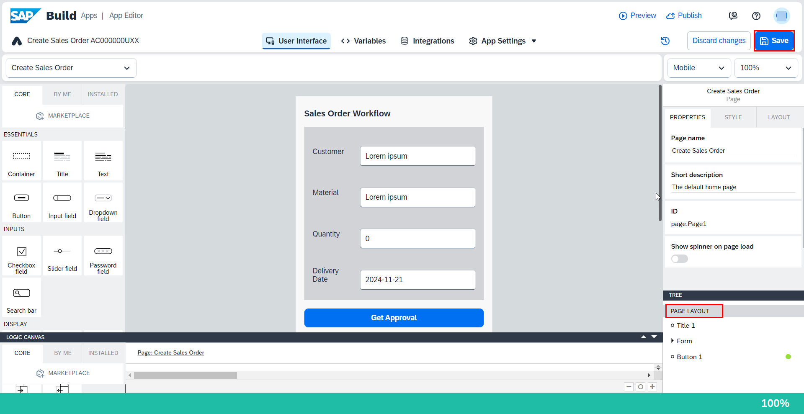

We need to set up the logic so when someone selects the **Get Approval** button (an event), we send the sales order data to our SAP Build Process Automation workflow using the trigger process. 

1. Press the **Get Approval** button, and open the logic canvas by choosing **Add logic to Button1** at the bottom right.

    

2. Drag a **Trigger process**  function onto the canvas, and **connect** the component tap event to it.

    

3. In the **logic canvas**, choose on the **Trigger process** and then choose **Custom Object**.

    

4. Map the Sales Order fields to their corresponding page variable (example below for **material**).

    

    | Sales Order fields | Page Variable    |
    | ----------- | -------------- |
    | material   | **material**|
    | quantity    | **quantity**|
    | shipToParty    | **customer**|
    | expectedDeliveryDate    | **date**|

    

5. For the remaining Sales Order fields, enter the following values as **Static text**.

    | Sales Order fields | Static Text Value    |
    | ----------- | -------------- |
    | soldToParty | **1000292**|
    | salesOrderType   | **OR**|
    | salesOrganisation | **1710**|
    | distributionChannel | **10**|

    

6. Select **Save**.

    
   

7. Drag a **Toast** flow function onto the canvas.

    

8. Connect the **top** output of the **Trigger process** flow function to it.

    

9. choose on the **Toast** flow function and configure it in the **Properties** pane on the right.

    For **Toast message**, choose **ABC** 

    

10. Select **Formula > Formula**.

    Erase the quotation marks, and enter the following formula:

```JavaScript
"Triggered process with ID: " + outputs["Trigger process"].newProcessInstance.id
```

11. Select **Save**.

    

12. Select **PAGE LAYOUT** then choose **Save** (upper right).

    


## Next step

Click here to start the next step: [Preview](../2_SAP-Build_E2E_BuildApps-Workflow/6_BuildApps-Workflow.md)