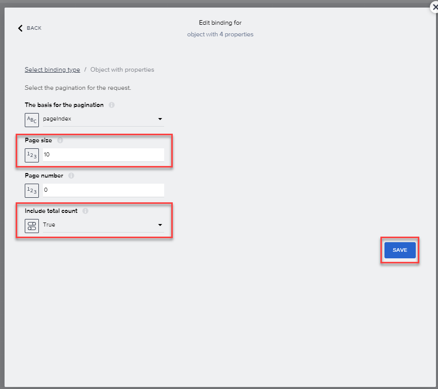

After retrieving the data, we need a place to put it with the proper schema so we can reference all its fields.

1. Select **Variables**.

    

2. On the left, select **Data Variables**.

    Then select **Add Data Variable**, and select **A_ProductDescription**.

    

3. Select on the new variable then choose on the **X** for **Filter condition**.

4. Using the **Object with properties** binding, **Add** the following three conditions:

| Property | Condition type | Compared value|
|-------|-------|-------|
| Product | less | MZ-FG-S|
| Language | equal | EN|
| Product | greater | MZ-FG-C8|

Select **Save** 

5. Select on the new variable again, and on the right-side of the page, go to **Paging** and choose on the **X**, and then select **Object with properties**.

    

    For **Page size**, select the **X**, select **Static number**, and change the number to **10**.

    For **Include total count**, select the **X**, select **Static true/false**, and change the value to **True**.

    

    Select **Save** 

6.  Select **Save** a second time (upper right).

## Next step

Click here to start the next step: [UI](../3_SAP-Build_E2E_BuildApps-Populate-Data/3_BuildApps-Populate-Data.md)