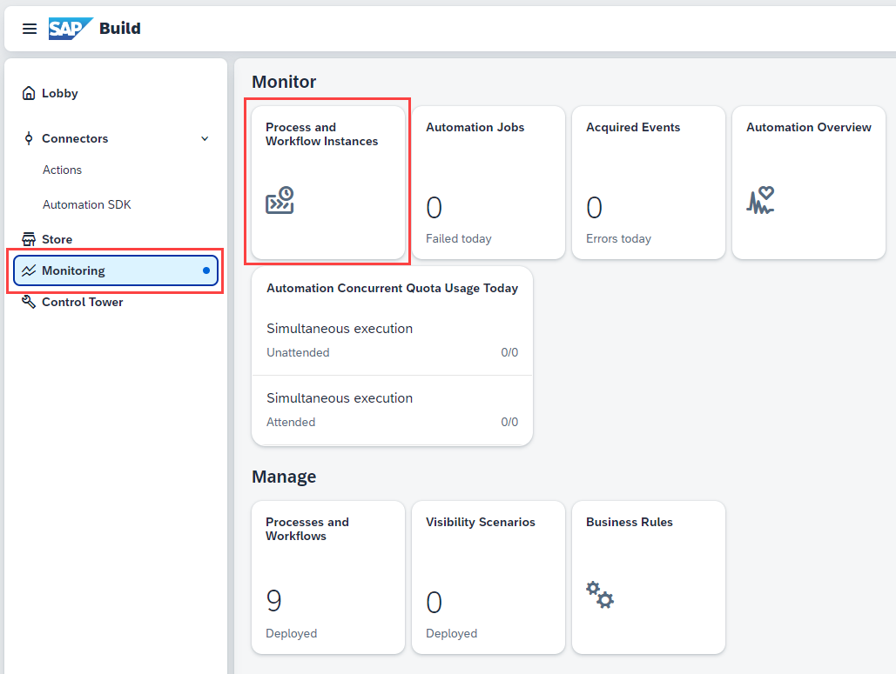

1. Preview and test the App again.

>If you already have a browser tab open to the web preview, it will refresh whenever you save the project.
>
>Otherwise, to preview the app, go to **Preview > Open web preview**, and then choose **Open** for the **Create Sales Order XP262-XXX (your user number)** project.

2. Enter the following values in your form:

    | Field | Value |
    |-------|-------|
    | Customer | XP262-XXX (your user number) Bikes |
    | Quantity  | 2000 |
    | Delivery Date  | 2024-12-01 |

3. For the material, select **MZ-FG-C900 (Cruise Bike C900)** from the dropdown for the material -- one of the products from the SAP S/4HANA Cloud system.

    This will also update the text field with the ID for the product.

    

4. Choose **Get Approval** to trigger the workflow. 

5. Go to the **Monitoring => Process and Workflow Instances** section of the Build Lobby.

    

6. You should see your instance, showing the quantity of **2000** and the material as **MZ-FG-C900**.

    

**Congratulations** you have completed the exercise!